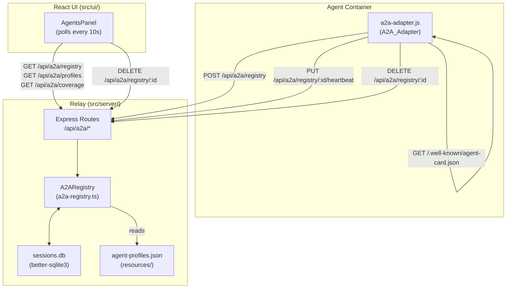
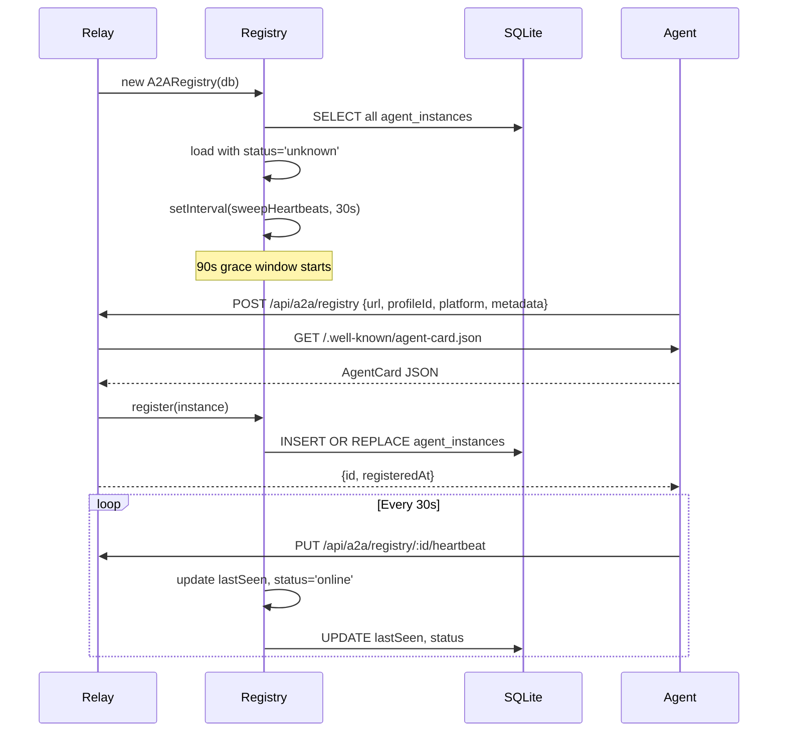

# Design: A2A Agent Registry

## Overview

The A2A Agent Registry extends Relay from a local process manager into a distributed control plane. Agents running anywhere (Docker, ECS, CDM, Windows, AgentCore) self-register on startup, send periodic heartbeats, and deregister on shutdown. Relay maintains an in-memory store backed by SQLite, exposes a REST API under `/api/a2a/*`, and surfaces a live observability panel in the React UI.

The design builds on existing infrastructure: `better-sqlite3` (already used for sessions), Express routes (already in `src/server/index.ts`), and the `scripts/a2a-adapter.js` container sidecar.

### Key Design Decisions

- **In-memory + SQLite**: The registry is always read from memory for speed; SQLite is the durable backing store. On startup, persisted instances are loaded with status `unknown` and promoted/demoted based on heartbeat activity within a 90-second grace window.
- **No ORM**: Raw `better-sqlite3` prepared statements, consistent with the existing `SessionStore` pattern.
- **Heartbeat via `setInterval`**: A single interval in the registry module sweeps for stale instances every 30 seconds.
- **Profile catalog from disk**: `resources/agent-profiles.json` is read on each `GET /api/a2a/profiles` request (no caching), satisfying the hot-reload requirement.
- **Self-registration in `scripts/a2a-adapter.js`**: The adapter reads env vars, calls `POST /api/a2a/registry` on startup, sends heartbeats, and calls `DELETE` on SIGTERM.

---

## Architecture



### Startup Sequence



---

## Components and Interfaces

### `src/server/a2a-registry.ts` — A2ARegistry class

The core module. Owns the in-memory map and all SQLite interactions.

```typescript
export type Platform = 'any' | 'linux' | 'cdm' | 'windows' | 'agentcore';
export type InstanceStatus = 'online' | 'offline' | 'unknown';

export interface AgentCard {
  name: string;
  description: string;
  version: string;
  skills: Array<{ id: string; name: string; tags: string[]; [key: string]: unknown }>;
  platform?: Platform;
  [key: string]: unknown;
}

export interface AgentInstance {
  id: string;           // UUID
  profileId: string;
  url: string;
  platform: Platform;
  card: AgentCard;
  metadata: Record<string, unknown>;
  registeredAt: number; // epoch ms
  lastSeen: number;     // epoch ms
  status: InstanceStatus;
}

export interface AgentProfile {
  id: string;
  label: string;
  description: string;
  platform: Platform;
  skills: string[];
  tools: string[];
  tags: string[];
  cardTemplate: AgentCard;
}

export interface CoverageEntry {
  online: number;
  offline: number;
}

export type Coverage = Record<Platform, CoverageEntry>;

export class A2ARegistry {
  constructor(db: Database) {}

  // Registration
  register(params: { url: string; profileId: string; platform: Platform; metadata: Record<string, unknown> }): Promise<{ id: string; registeredAt: number }>
  deregister(id: string): boolean
  heartbeat(id: string): boolean

  // Queries
  getAll(filter?: { status?: InstanceStatus; tag?: string; platform?: Platform }): AgentInstance[]
  getById(id: string): AgentInstance | undefined
  getCoverage(): Coverage

  // Profiles (reads from disk)
  getProfiles(): AgentProfile[]

  // Routing
  findBestInstance(profileId?: string, tags?: string[]): AgentInstance | undefined

  // Lifecycle
  startHeartbeatSweep(): void
  stopHeartbeatSweep(): void
}
```

### `src/server/index.ts` — Route mounting

New routes are mounted before the static file handler:

```typescript
import { createA2ARouter } from './a2a-registry.js';
// ...
app.use('/api/a2a', createA2ARouter(a2aRegistry));
```

### `scripts/a2a-adapter.js` — Self-registration additions

New logic added to the existing adapter:

```javascript
// On startup (when ORCHESTRATOR_URL is set)
async function selfRegister() { ... }

// Heartbeat loop
function startHeartbeat(instanceId) {
  return setInterval(() => {
    fetch(`${ORCHESTRATOR_URL}/api/a2a/registry/${instanceId}/heartbeat`, { method: 'PUT' })
      .catch(err => console.warn('[a2a] heartbeat failed:', err.message));
  }, 30_000);
}

// On SIGTERM
process.on('SIGTERM', async () => {
  if (registeredId) {
    await fetch(`${ORCHESTRATOR_URL}/api/a2a/registry/${registeredId}`, { method: 'DELETE' }).catch(() => {});
  }
  process.exit(0);
});
```

### `src/ui/components/AgentsPanel.tsx` — New React component

Polls `/api/a2a/registry`, `/api/a2a/profiles`, and `/api/a2a/coverage` every 10 seconds. Renders:
- Coverage summary bar at top
- Online instances with full metadata
- Offline instances (dimmed)
- Catalog profiles with no instance (greyed out, "not running" badge)
- Deregister button per instance

---

## Data Models

### SQLite Schema

New table added to `sessions.db`:

```sql
CREATE TABLE IF NOT EXISTS agent_instances (
  id           TEXT PRIMARY KEY,
  profileId    TEXT NOT NULL,
  url          TEXT NOT NULL,
  platform     TEXT NOT NULL DEFAULT 'any',
  card         TEXT NOT NULL,      -- JSON
  metadata     TEXT NOT NULL DEFAULT '{}', -- JSON
  registeredAt INTEGER NOT NULL,
  lastSeen     INTEGER NOT NULL,
  status       TEXT NOT NULL DEFAULT 'unknown'
);
```

### `resources/agent-profiles.json`

```json
[
  {
    "id": "coding-assistant",
    "label": "Coding Assistant",
    "description": "General-purpose coding agent with file system and terminal access",
    "platform": "any",
    "skills": ["coding", "files", "terminal"],
    "tools": ["filesystem", "terminal"],
    "tags": ["coding", "files", "terminal"],
    "cardTemplate": {
      "name": "Kiro Coding Assistant",
      "description": "Write, edit, and explain code",
      "version": "1.0.0",
      "skills": [{ "id": "coding-assistant", "name": "Coding Assistant", "tags": ["coding", "files", "terminal"] }]
    }
  },
  {
    "id": "diagram-specialist",
    "label": "Diagram Specialist",
    "description": "Generates architecture and flow diagrams",
    "platform": "any",
    "skills": ["diagrams", "mermaid", "plantuml"],
    "tools": ["diagram-mcp"],
    "tags": ["diagrams", "architecture", "visualization"],
    "cardTemplate": { ... }
  },
  {
    "id": "outlook-manager",
    "label": "Outlook Manager",
    "description": "Manages email and calendar via Outlook",
    "platform": "windows",
    "skills": ["email", "calendar"],
    "tools": ["outlook-mcp"],
    "tags": ["email", "calendar", "outlook"],
    "cardTemplate": { ... }
  },
  {
    "id": "disk-manager",
    "label": "Disk Manager",
    "description": "Manages files on Windows or CDM filesystems",
    "platform": "windows",
    "skills": ["filesystem", "powershell"],
    "tools": ["filesystem"],
    "tags": ["files", "windows", "powershell"],
    "cardTemplate": { ... }
  },
  {
    "id": "pdf-processor",
    "label": "PDF Processor",
    "description": "Extracts and processes PDF content",
    "platform": "linux",
    "skills": ["pdf", "extraction"],
    "tools": ["pdf-mcp"],
    "tags": ["pdf", "documents", "extraction"],
    "cardTemplate": { ... }
  }
]
```

### REST API Contract

| Method | Path | Description |
|--------|------|-------------|
| `POST` | `/api/a2a/registry` | Register a new agent instance |
| `GET` | `/api/a2a/registry` | List all instances (supports `?tag=` and `?platform=` filters) |
| `GET` | `/api/a2a/registry/online` | List only online instances |
| `GET` | `/api/a2a/registry/:id` | Get a single instance |
| `DELETE` | `/api/a2a/registry/:id` | Deregister an instance |
| `PUT` | `/api/a2a/registry/:id/heartbeat` | Update lastSeen, set status online |
| `GET` | `/api/a2a/profiles` | List all known agent profiles from catalog |
| `GET` | `/api/a2a/coverage` | Get platform coverage summary |

### AgentCard Environment Variable Mapping

| Env Var | Effect |
|---------|--------|
| `A2A_PROFILE` | Load `cardTemplate` from matching profile in catalog |
| `A2A_SKILLS` | Comma-separated skill IDs, overrides profile skills |
| `A2A_TAGS` | Comma-separated tags, overrides profile tags |
| `A2A_PLATFORM` | Sets `platform` field in card and registration payload |
| `A2A_LABEL` | Overrides the card `name` field |
| `ORCHESTRATOR_URL` | If set, triggers self-registration on startup |

---

## Correctness Properties

*A property is a characteristic or behavior that should hold true across all valid executions of a system — essentially, a formal statement about what the system should do. Properties serve as the bridge between human-readable specifications and machine-verifiable correctness guarantees.*

### Property 1: Registration round-trip

*For any* valid registration payload `{ url, profileId, platform, metadata }` where the agent card fetch succeeds, registering and then querying by the returned `id` SHALL return an instance whose `url`, `profileId`, and `platform` match the original payload.

**Validates: Requirements 2.1, 2.4**

### Property 2: Heartbeat promotes offline to online

*For any* AgentInstance with status `offline`, calling `heartbeat(id)` SHALL set that instance's status to `online` and update `lastSeen` to a timestamp greater than or equal to the previous `lastSeen`.

**Validates: Requirements 3.3, 4.6**

### Property 3: Stale instances go offline

*For any* AgentInstance whose `lastSeen` is more than 90 seconds in the past, after the heartbeat sweep runs, that instance's status SHALL be `offline`.

**Validates: Requirements 3.2**

### Property 4: Tag filter excludes non-matching instances

*For any* set of registered instances and any tag value `t`, `getAll({ tag: t })` SHALL return only instances whose AgentCard skills contain at least one skill with tag `t`.

**Validates: Requirements 4.7**

### Property 5: Platform filter excludes non-matching instances

*For any* set of registered instances and any platform value `p`, `getAll({ platform: p })` SHALL return only instances whose `platform` field equals `p`.

**Validates: Requirements 4.8**

### Property 6: Coverage counts are consistent with instance list

*For any* set of registered instances, the sum of all `online` counts across all platforms in `getCoverage()` SHALL equal the count of instances returned by `getAll({ status: 'online' })`.

**Validates: Requirements 5.1**

### Property 7: Deregistration removes instance

*For any* registered AgentInstance, calling `deregister(id)` SHALL cause `getById(id)` to return `undefined` and `getAll()` to not include that instance.

**Validates: Requirements 4.5**

### Property 8: AgentCard env var override is applied

*For any* combination of `A2A_PROFILE`, `A2A_SKILLS`, and `A2A_TAGS` environment variables, the card served at `/.well-known/agent-card.json` SHALL reflect the overrides: skills from `A2A_SKILLS` (if set) replace the profile template skills, and tags from `A2A_TAGS` (if set) replace the profile template tags.

**Validates: Requirements 6.1, 6.2, 6.3**

---

## Error Handling

### Registration failures

- Agent card fetch fails (network error, non-200): return HTTP 400 `{ message: "Failed to fetch agent card: <reason>" }`
- Missing required fields (`url`, `profileId`, `platform`): return HTTP 400 `{ message: "Missing required field: <field>" }`
- Unknown `profileId`: log a warning but allow registration (profiles are advisory, not enforced)

### Heartbeat for unknown instance

- `PUT /api/a2a/registry/:id/heartbeat` with unknown `id`: return HTTP 404 `{ message: "Instance not found" }`

### Deregister unknown instance

- `DELETE /api/a2a/registry/:id` with unknown `id`: return HTTP 404 `{ message: "Instance not found" }`

### SQLite errors

- All SQLite operations are wrapped in try/catch; errors are logged and the in-memory state is treated as authoritative. The registry continues operating if SQLite is temporarily unavailable.

### A2A_Adapter self-registration failure

- If `POST /api/a2a/registry` fails on startup, the adapter logs a warning and continues serving A2A requests. It retries registration on the next heartbeat interval.

---

## Testing Strategy

### Unit tests (vitest)

Located in `src/server/a2a-registry.test.ts`. Use an in-memory SQLite database (`:memory:`) to isolate tests from the filesystem.

- Registration with valid payload returns `{ id, registeredAt }`
- Registration with duplicate URL+profileId upserts rather than duplicates
- Registration with failed card fetch returns error
- Heartbeat updates `lastSeen` and sets status to `online`
- Heartbeat on unknown ID returns false
- Deregister removes instance from memory and SQLite
- `getAll()` with tag filter returns only matching instances
- `getAll()` with platform filter returns only matching instances
- `getCoverage()` counts match `getAll()` results
- Startup load sets all instances to `unknown`
- Sweep after 90s sets `unknown`/stale instances to `offline`

### Property-based tests (vitest + fast-check)

Each property test runs a minimum of 100 iterations. Tests are tagged with the property they validate.

```typescript
// Feature: a2a-registry, Property 1: Registration round-trip
it.prop([fc.record({ url: fc.webUrl(), profileId: fc.string(), platform: fc.constantFrom('any','linux','cdm','windows','agentcore'), metadata: fc.object() })])(
  'registration round-trip preserves payload fields',
  async (payload) => { ... }
);
```

Property-based testing library: **fast-check** (`npm install --save-dev fast-check`)

Each property test:
- Uses `:memory:` SQLite
- Mocks the agent card fetch (returns a valid card for any URL)
- Runs 100+ iterations with generated inputs
- Is tagged with `// Feature: a2a-registry, Property N: <property text>`

### Integration tests

- `POST /api/a2a/registry` against a real Express app with a real SQLite file
- Heartbeat sweep timing (use fake timers)
- Startup load from persisted SQLite state

### UI tests

- `AgentsPanel` renders online/offline/catalog instances correctly (snapshot test)
- Deregister button calls `DELETE /api/a2a/registry/:id`
- Coverage bar reflects platform counts
