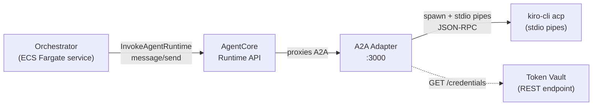
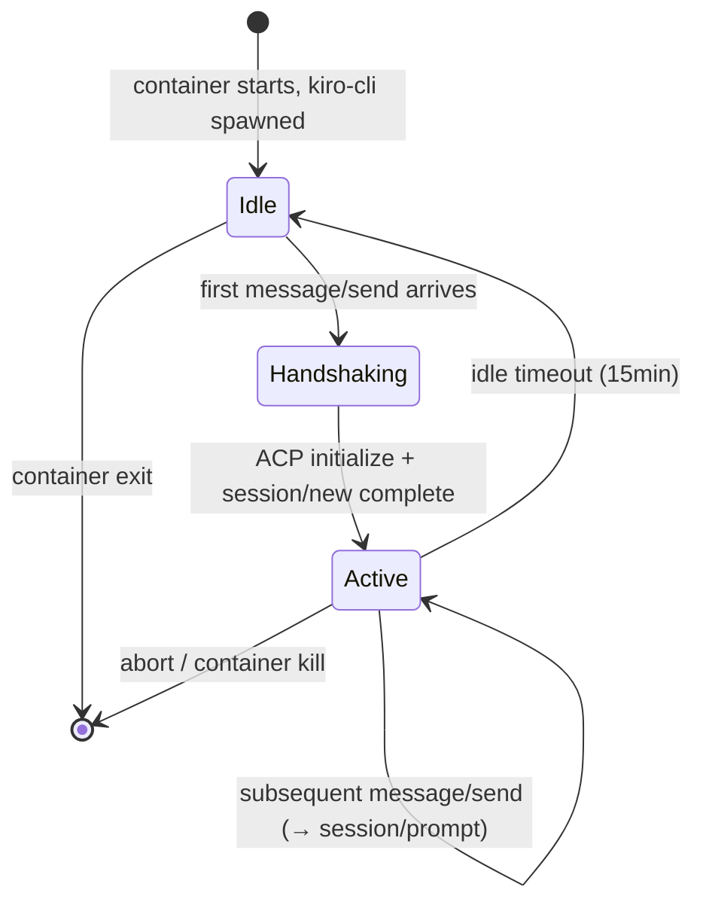
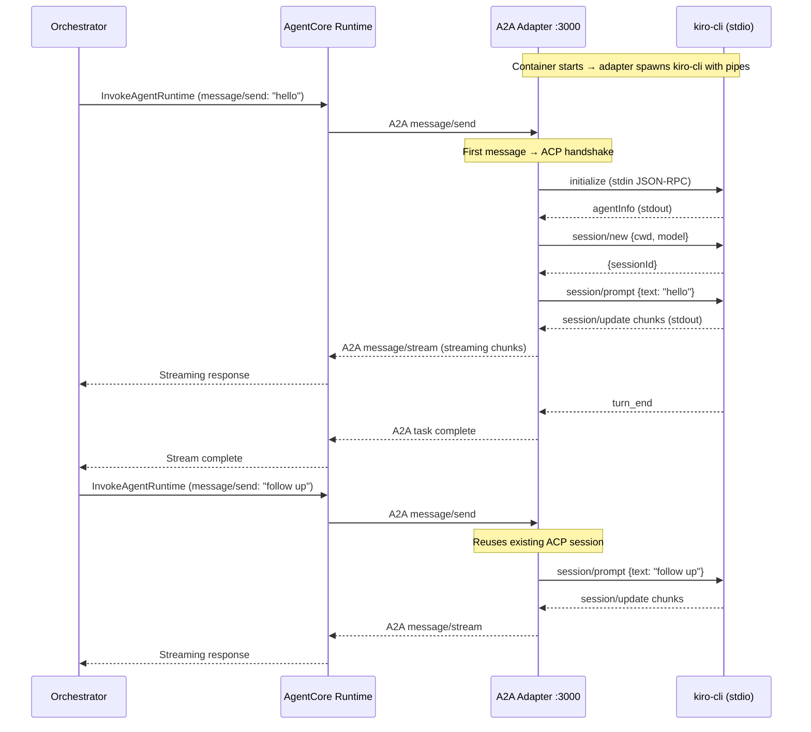

# Design Document: AgentCore Runtime Sub-Agent

## Overview

This design adds AgentCore Runtime as an alternative backend for launching kiro-cli sub-agent containers, alongside the existing ECS Fargate and local process runners. The core challenge is that AgentCore Runtime supports HTTP, MCP, A2A, and AG-UI protocols — but the sub-agent container speaks ACP (JSON-RPC) over raw TCP on port 8080. This requires a protocol adapter layer inside the container.

The system introduces three new components:

1. **A2A Adapter** — An A2A-protocol-compliant server inside the container (port 3000) that spawns kiro-cli directly as a child process with stdio pipes and translates between A2A protocol and ACP JSON-RPC. No TCP bridge or PTY hack needed — verified that Node.js `spawn()` with plain pipes works (kiro-cli stays alive as long as stdin remains open).
2. **AgentCore Runner** — A new runner implementation (`src/server/agentcore-runner.ts`) parallel to `createEcsRunner` that uses AgentCore Runtime's `InvokeAgentRuntime` API. Unlike the ECS runner, this is request-driven — Runtime proxies requests to the container, there is no "discover container IP" step. The orchestrator calls `InvokeAgentRuntime` with A2A `message/send` or `message/stream` payloads.
3. **Credential Adapter** — An entrypoint wrapper that calls the Token Vault REST endpoint (`KIRO_TOKEN_VAULT_ENDPOINT`) to fetch credentials, then writes them to kiro-cli's `auth_kv` SQLite format.

The orchestrator's `RunnerManager` gains a three-way toggle: local → ECS → AgentCore, controlled by environment variables.

> **Note:** The container image MUST be built for ARM64 — this is a hard requirement from the AgentCore Runtime protocol contract.



## Architecture

### Protocol Adapter: A2A Adapter

AgentCore Runtime supports HTTP, MCP, A2A, and AG-UI protocols. It does **not** support raw TCP or ACP natively. The existing sub-agent container exposes only a raw TCP socket on port 8080 speaking ACP (newline-delimited JSON-RPC). A protocol adapter is required.

The A2A adapter (implemented by the cowboy's spike) is an A2A-protocol-compliant server that:

- Listens on port 3000 (the port AgentCore Runtime connects to)
- Speaks the A2A protocol (`message/send`, `message/stream`), making the sub-agent a proper discoverable A2A agent
- Spawns kiro-cli directly as a child process with plain stdio pipes (no TCP bridge, no PTY hack needed — see "PTY Finding" below)
- Translates A2A messages into ACP JSON-RPC on kiro-cli's stdin
- Streams ACP `session/update` responses back as A2A streaming messages
- Manages ACP session lifecycle internally (first `message/send` triggers ACP handshake, subsequent messages reuse the session)

Container request flow:
```
AgentCore Runtime → A2A message/send :3000 → a2a-adapter → spawn kiro-cli acp (stdio pipes) → JSON-RPC
```

#### PTY Finding (Verified)

We tested kiro-cli v1.29.1 three ways:
1. **Bash pipe** (`echo '...' | kiro-cli acp`) — silent exit. Stdin closes immediately after echo, kiro-cli exits.
2. **PTY bridge** (`script -q -c 'kiro-cli acp'`) — works. The PTY keeps stdin open.
3. **Node.js spawn with pipes** (`spawn('kiro-cli', ['acp', ...], { stdio: ['pipe','pipe','pipe'] })`) — **works**. Plain pipes, no PTY.

The issue isn't `isatty()` — it's whether stdin stays open. Node.js `spawn` keeps the pipe open, so kiro-cli stays alive. This means the A2A adapter can spawn kiro-cli directly — no bridge, no PTY hack. The PTY bridge is only needed for the ECS TCP bridge case where a remote TCP socket is translated to stdio.

### Key Design Decisions

**Decision 1: A2A Adapter Inside Container (Chosen Approach)**

An A2A-protocol-compliant server inside the container that accepts A2A messages from AgentCore Runtime, translates them to ACP JSON-RPC, and streams responses back.

*Rationale:* A2A is one of the four protocols AgentCore Runtime natively supports. Using A2A (rather than a custom HTTP API) makes the sub-agent a proper discoverable agent that any A2A client can talk to — not just our orchestrator. The cowboy's spike proved this works. The existing ACP bridge and kiro-cli remain untouched.

**Decision 2: Alternatives Considered**

| Approach | Status | Notes |
|----------|--------|-------|
| **A2A Protocol** | **Chosen** | The cowboy's spike proved this works. Sub-agent becomes a proper A2A agent. AgentCore Runtime natively supports it. |
| **Custom HTTP API** | **Rejected (originally proposed)** | Would work but creates a bespoke API that only our orchestrator understands. A2A is the standard. |
| **MCP Tool** | **Rejected** | MCP tools are stateless request/response. ACP sessions are stateful with streaming. Would require reinventing session management inside an MCP tool handler. |
| **Direct TCP** | **Not available** | AgentCore Runtime doesn't support raw TCP. When Runtime adds ACP support (planned), the adapter goes away. |
| **AG-UI** | **Rejected** | Designed for frontend agent UIs, not backend agent-to-agent communication. Wrong abstraction level. |

**Decision 3: Orchestrator Connection Strategy — Request-Driven (Not Task-Driven)**

AgentCore Runtime's invocation model is fundamentally different from ECS. With ECS, you `RunTask`, discover the container IP, then connect directly. With AgentCore Runtime, you call `InvokeAgentRuntime` and Runtime proxies your request to the container. There is no "discover container IP" step.

This means the AgentCore runner is simpler than the ECS runner:
- No `DescribeTasks` polling loop
- No IP discovery from ENI attachments
- No direct TCP connection management
- The orchestrator sends requests through Runtime's API, and Runtime handles routing

The runner calls `InvokeAgentRuntime` for each interaction (session creation, prompts, cancellation). Runtime maintains the container and routes requests to it.

| Aspect | ECS Runner | AgentCore Runner |
|--------|-----------|-----------------|
| Launch | `RunTask` → poll `DescribeTasks` → get IP | `InvokeAgentRuntime` (Runtime manages container) |
| Connect | Direct TCP to container IP:8080 | Runtime proxies to container's A2A adapter |
| Protocol | ACP JSON-RPC over TCP | A2A over HTTP (via Runtime proxy) |
| Lifecycle | Orchestrator manages (StopTask, idle sweep) | Runtime manages (auto-scaling, health) |

**Decision 4: Session State Management in A2A Adapter**

The A2A adapter manages ACP session state internally. The orchestrator does NOT call separate `/session/new` or `/session/prompt` endpoints — it sends A2A `message/send` or `message/stream` payloads via `InvokeAgentRuntime`, and the adapter handles the ACP lifecycle:



- First `message/send` triggers ACP handshake (`initialize` → `session/new`) automatically
- Subsequent `message/send` calls translate to `session/prompt` on the existing ACP session
- `message/stream` variant streams ACP `session/update` chunks back as A2A streaming events
- Idle timeout (configurable, default 15 minutes) closes ACP session and exits

**Decision 5: Dual-Mode Container Image**

The container image remains compatible with both ECS Fargate (raw TCP) and AgentCore Runtime (HTTP wrapper). The entrypoint detects the environment:

- If `AGENTCORE_RUNTIME=true` → start A2A adapter (which spawns kiro-cli directly with stdio pipes)
- Otherwise → start ACP bridge directly (existing ECS behavior)

This preserves rollback capability per Requirement 10.

### Component Topology

| Component | File | Changes |
|-----------|------|---------|
| AgentCore Runner | `src/server/agentcore-runner.ts` | **New** — request-driven runner using `InvokeAgentRuntime` |
| A2A Adapter | `scripts/a2a-adapter.js` | **Exists** — cowboy's spike, A2A-to-ACP protocol adapter |
| Credential Adapter | `scripts/agentcore-entrypoint.sh` | **New** — Token Vault REST fetch → auth_kv translator |
| Token Vault Seeder | `scripts/seed-token-vault.sh` | **New** — one-time credential upload script |
| Runner Manager | `src/server/runner-manager.ts` | **Modified** — add AgentCore runner toggle |
| Dockerfile | `Dockerfile.kiro-cli` | **Modified** — add A2A adapter, ARM64 build, conditional entrypoint |
| ACP TCP Transport | `src/server/acp-tcp.ts` | **Unchanged** |
| ACP Bridge | `scripts/acp-bridge.js` | **Unchanged** |
| ECS Runner | `src/server/ecs-runner.ts` | **Unchanged** |
| Local Runner | `src/server/runner.ts` | **Unchanged** |

### Request Flow (A2A via Runtime)



## Components and Interfaces

### 1. A2A Adapter (`scripts/a2a-adapter.js`)

The protocol adapter that bridges A2A (AgentCore Runtime) to ACP (kiro-cli). Spawns kiro-cli directly with stdio pipes — no TCP bridge or PTY needed.

```typescript
// Conceptual interface — implemented by cowboy's spike

// A2A protocol endpoints (standard A2A, not custom):
// POST /.well-known/agent.json — A2A agent card (discovery)
// POST /a2a — A2A message handler
//   message/send — send a message, get response
//   message/stream — send a message, stream response chunks

// Internal: the adapter spawns kiro-cli as a child process
// and manages the ACP session lifecycle transparently.
// The orchestrator never sees ACP — it only sees A2A.

// Internal state:
interface AdapterState {
  kiroProcess: ChildProcess;    // kiro-cli spawned with stdio pipes
  acpSessionId: string | null;  // set after first handshake
  handshakeComplete: boolean;
  lastActivity: number;
  buffer: string;               // JSON-RPC line buffer from stdout
  rpcId: number;
}
```

### 2. AgentCore Runner (`src/server/agentcore-runner.ts`)

New runner implementation that uses AgentCore Runtime API for container lifecycle. Implements the same `RunnerHandle` interface as `createEcsRunner` and `createAcpRunner`.

```typescript
import type { RunnerHandle } from "./runner.js";
import type { ServerEvent } from "../electron/types.js";
import type { Session } from "../electron/libs/session-store.js";
import type { AgentDefinition } from "./agent-registry.js";

interface AgentCoreConfig {
  agentId: string;        // env: AGENTCORE_AGENT_ID
  region: string;         // env: AGENTCORE_REGION (default: us-east-1)
  endpoint?: string;      // env: AGENTCORE_ENDPOINT (optional override)
  startupTimeoutMs: number; // default: 120_000
}

export interface AgentCoreRunnerInfo {
  agentRuntimeId: string;
  containerState: string;
  invocationId: string | null;
  launchedAt: number;
  connectedAt: number | null;
  startupLatencyMs: number | null;
}

export function createAgentCoreRunner(opts: {
  session: Session;
  model: string;
  agent: AgentDefinition;
  onEvent: (event: ServerEvent) => void;
  onSessionUpdate?: (updates: Partial<Session>) => void;
}): RunnerHandle;

// Returns health info for a session (used by /api/sessions/health)
export function getAgentCoreRunnerInfo(sessionId: string): AgentCoreRunnerInfo | undefined;
```

The runner follows a request-driven pattern (unlike the ECS runner's task-driven pattern):
1. Call `InvokeAgentRuntime` — Runtime proxies the request to the container's A2A adapter
2. No IP discovery or direct connection needed — Runtime handles routing
3. On `sendPrompt`, call `InvokeAgentRuntime` with the prompt payload
4. Runtime proxies to the A2A adapter, which translates to ACP and streams back
5. Map A2A response events to the same `ServerEvent` types the orchestrator expects
6. On `abort`, call `InvokeAgentRuntime` with a cancel payload, then optionally stop the agent

> **Note:** Properties 1, 4, 7, 12, 13 are already tested by the cowboy's A2A adapter spike. The AgentCore runner tests should reference that work rather than re-derive.

### 3. Credential Adapter (`scripts/agentcore-entrypoint.sh`)

Entrypoint wrapper for AgentCore Runtime deployments. Calls the Token Vault REST endpoint to fetch credentials and writes them to kiro-cli's SQLite before starting the A2A adapter.

```bash
#!/bin/bash
# scripts/agentcore-entrypoint.sh
#
# 1. Call Token Vault REST endpoint (KIRO_TOKEN_VAULT_ENDPOINT) to fetch OIDC creds
#    — Token Vault is a REST API, NOT env var injection
#    — The container calls GET /credentials/kirocli-oidc with workload identity auth
# 2. If present: extract OIDC creds, write to auth_kv table
# 3. If not present: fall back to bootstrap-auth.sh logic (Secrets Manager → S3 → local file)
# 4. Start A2A adapter (which starts ACP bridge internally)
#
# NOTE: The existing bootstrap-auth.sh already has KIRO_TOKEN_VAULT_ENDPOINT logic.
# This entrypoint reuses that logic and adds AgentCore-specific detection.
```

### 4. Token Vault Seeder (`scripts/seed-token-vault.sh`)

One-time script to upload kiro-cli OIDC credentials to AgentCore Token Vault.

```bash
#!/bin/bash
# scripts/seed-token-vault.sh
#
# Prerequisites:
#   - kiro-cli login completed (valid device registration in data.sqlite3)
#   - AWS credentials with permission to write to Token Vault
#   - AGENTCORE_AGENT_ID set (identifies which agent's vault to write to)
#
# Usage:
#   AGENTCORE_AGENT_ID=my-kiro-agent ./scripts/seed-token-vault.sh
#
# Steps:
#   1. Extract kirocli:oidc:device-registration from local data.sqlite3
#   2. Format as Token Vault credential payload
#   3. Upload via AgentCore Identity API (PUT /credentials/kirocli-oidc)
#   4. Verify by reading back (GET /credentials/kirocli-oidc)
```

### 5. Runner Manager Changes (`src/server/runner-manager.ts`)

The `spawn` method gains a three-way toggle:

```typescript
// Current logic (line ~68 of runner-manager.ts):
const handle = process.env.ECS_RUNNER_ENABLED === 'true'
  ? createEcsRunner({ ... })
  : createAcpRunner({ ... });

// New logic:
const handle = process.env.AGENTCORE_RUNNER_ENABLED === 'true'
  ? createAgentCoreRunner({ ... })
  : process.env.ECS_RUNNER_ENABLED === 'true'
    ? createEcsRunner({ ... })
    : createAcpRunner({ ... });

// With warning if both are set:
if (process.env.AGENTCORE_RUNNER_ENABLED === 'true' && process.env.ECS_RUNNER_ENABLED === 'true') {
  console.warn('[runner-manager] Both AGENTCORE_RUNNER_ENABLED and ECS_RUNNER_ENABLED are set. Using AgentCore runner.');
}
```

### 6. Health Endpoint Extension

The `/api/sessions/health` response includes AgentCore-specific fields when the AgentCore runner is active:

```typescript
// Extended session health entry
interface SessionHealthEntry {
  id: string;
  state: string;
  idleSeconds: number | null;
  // ECS-specific (existing)
  ecsTaskArn?: string;
  ecsTaskState?: string;
  // AgentCore-specific (new)
  agentCoreRuntimeId?: string;
  agentCoreContainerState?: string;
  agentCoreInvocationId?: string;
}
```

### 7. Dockerfile Changes

```dockerfile
# CRITICAL: AgentCore Runtime requires ARM64 images
# Build with: docker buildx build --platform linux/arm64 -f Dockerfile.kiro-cli .

# Added to Dockerfile.kiro-cli:
COPY --chown=kiro:kiro scripts/a2a-adapter.js /home/kiro/a2a-adapter.js
COPY --chown=kiro:kiro scripts/agentcore-entrypoint.sh /home/kiro/agentcore-entrypoint.sh
RUN chmod +x /home/kiro/agentcore-entrypoint.sh

# Entrypoint remains bootstrap-auth.sh for ECS compatibility
# For AgentCore: override entrypoint to agentcore-entrypoint.sh via Runtime config
```

## Data Models

### AgentCore Runner State

Internal state tracked per session in the AgentCore runner:

```typescript
interface AgentCoreRunnerState {
  agentRuntimeId: string;         // AgentCore agent runtime identifier
  invocationId: string | null;    // Current invocation ID
  containerState: string;         // LAUNCHING | RUNNING | STOPPING | FAILED
  httpEndpoint: string | null;    // HTTP endpoint URL (from Runtime API)
  acpSessionId: string | null;    // ACP session ID (from HTTP wrapper)
  launchedAt: number;
  connectedAt: number | null;
  startupLatencyMs: number | null;
}
```

### Environment Variables

| Variable | Component | Description | Default |
|----------|-----------|-------------|---------|
| `AGENTCORE_RUNNER_ENABLED` | Orchestrator | Enable AgentCore runner | `false` |
| `AGENTCORE_AGENT_ID` | Orchestrator | Agent runtime identifier in AgentCore | required |
| `AGENTCORE_REGION` | Orchestrator | AWS region for AgentCore API | `us-east-1` |
| `AGENTCORE_ENDPOINT` | Orchestrator | Custom AgentCore API endpoint URL | auto |
| `AGENTCORE_STARTUP_TIMEOUT_MS` | Orchestrator | Max wait for container ready | `120000` |
| `AGENTCORE_RUNTIME` | Container | Signals container is running on AgentCore | set by Runtime |
| `KIRO_TOKEN_VAULT_ENDPOINT` | Container | Token Vault REST endpoint URL for credential fetch | set by Runtime or operator |
| `ECS_RUNNER_ENABLED` | Orchestrator | Enable ECS runner (existing) | `false` |
| `KIRO_MAX_SESSIONS` | Orchestrator | Max concurrent sessions (existing) | `5` |
| `KIRO_IDLE_TIMEOUT_MINUTES` | Orchestrator | Idle timeout (existing) | `15` |

### A2A Protocol Interface

The A2A adapter exposes standard A2A endpoints. The orchestrator interacts via `InvokeAgentRuntime` which proxies A2A messages — it never calls custom endpoints.

| A2A Method | Maps To | Description |
|------------|---------|-------------|
| `message/send` | ACP `session/prompt` | Send prompt, get final response |
| `message/stream` | ACP `session/prompt` + streaming `session/update` | Send prompt, stream response chunks |
| Agent card (`/.well-known/agent.json`) | — | A2A discovery metadata |

### A2A Streaming Event Format

When using `message/stream`, ACP `session/update` chunks are relayed as A2A streaming events:

```json
{"type": "task.status", "status": {"state": "working"}}
{"type": "task.artifact", "artifact": {"parts": [{"type": "text", "text": "Hello"}]}}
{"type": "task.artifact", "artifact": {"parts": [{"type": "text", "text": " world"}]}}
{"type": "task.status", "status": {"state": "completed"}}
```

### ACP Protocol Messages (Unchanged)

The ACP JSON-RPC protocol between HTTP wrapper and ACP bridge is identical to the existing protocol:

```
→ initialize {protocolVersion, clientCapabilities, clientInfo}
← {agentInfo}
→ session/new {cwd, model, mcpServers}
← {sessionId}
→ session/prompt {sessionId, prompt: [{type: "text", text}]}
← session/update {update: {sessionUpdate: "agent_message_chunk", content: {type, text}}}
← session/update {update: {sessionUpdate: "tool_call", title, toolName}}
← session/update {update: {sessionUpdate: "turn_end"}}
→ session/cancel {sessionId}
```

### Token Vault Credential Format

Token Vault stores credentials keyed by a credential name (e.g., `kirocli-oidc`). The seeder uploads:

```json
{
  "device_registration": {
    "client_id": "...",
    "client_secret": "...",
    "refresh_token": "...",
    "start_url": "...",
    "region": "us-east-1",
    "registration_expiry": "..."
  }
}
```

The credential adapter reads this and writes to SQLite:

```sql
INSERT OR REPLACE INTO auth_kv (key, value)
VALUES ('kirocli:oidc:device-registration', '<JSON from device_registration>');
```


## Correctness Properties

*A property is a characteristic or behavior that should hold true across all valid executions of a system — essentially, a formal statement about what the system should do. Properties serve as the bridge between human-readable specifications and machine-verifiable correctness guarantees.*

### Property 1: RunnerHandle Interface Conformance

*For any* `AgentCoreRunner` instance created with valid options, the returned `RunnerHandle` object shall expose all required methods (`abort`, `sendPrompt`, `ready`, `onClose`) with the correct signatures, matching the interface implemented by `createEcsRunner` and `createAcpRunner`.

**Validates: Requirements 2.1**

### Property 2: Invocation API Receives Session Parameters

*For any* session request with a session ID, working directory, and model selection, when the AgentCore runner is enabled, the runner shall call the AgentCore Runtime invocation API with all three parameters present and matching the input values.

**Validates: Requirements 2.2, 2.3**

### Property 3: Network Endpoint Discovery

*For any* AgentCore Runtime container that reaches a running state, the AgentCore runner shall extract a valid network endpoint (host and port) from the Runtime API response, such that the endpoint can be used for subsequent HTTP or TCP connection.

**Validates: Requirements 2.4**

### Property 4: Prompt Forwarding and Event Relay

*For any* valid prompt string sent via `sendPrompt`, the AgentCore runner shall forward the prompt to the sub-agent and relay all `session/update` events (agent_message_chunk, tool_call, turn_end) back to the orchestrator's event emitter in the same order they were received.

**Validates: Requirements 2.6**

### Property 5: Abort Sends Cancel and Terminates

*For any* active AgentCore runner session, calling `abort` shall send a `session/cancel` ACP message to the sub-agent and then call the AgentCore Runtime API to terminate the container. After abort, no further events shall be emitted.

**Validates: Requirements 2.7**

### Property 6: Invocation Failure Propagation

*For any* AgentCore Runtime invocation that fails (API error response, network error, or startup timeout exceeding the configured limit), the AgentCore runner shall emit a `runner.error` event with a descriptive message and reject the `ready` promise.

**Validates: Requirements 2.8, 8.5**

### Property 7: Connection Drop Detection

*For any* established TCP/HTTP connection to a sub-agent that drops unexpectedly, the AgentCore runner shall emit a `session.status` event with status `error` and invoke all registered close callbacks.

**Validates: Requirements 2.9**

### Property 8: Credential Round-Trip

*For any* valid kiro-cli OIDC credential (device_registration containing client_id, client_secret, refresh_token), seeding it to Token Vault via the seeder script and then reading it back via the credential adapter shall produce an `auth_kv` row with key `kirocli:oidc:device-registration` whose JSON value is equivalent to the original credential.

**Validates: Requirements 3.2, 9.2**

### Property 9: Credential Adapter Fallback

*For any* container startup where Token Vault credentials are absent, malformed, or delivery fails, the credential adapter shall invoke the existing `bootstrap-auth.sh` fallback logic and not exit with an error before attempting fallback sources.

**Validates: Requirements 3.5**

### Property 10: Runner Selection Toggle

*For any* combination of `AGENTCORE_RUNNER_ENABLED` and `ECS_RUNNER_ENABLED` environment variable values, the RunnerManager shall select the correct runner: AgentCore if `AGENTCORE_RUNNER_ENABLED=true` (regardless of ECS setting), ECS if only `ECS_RUNNER_ENABLED=true`, local otherwise. When both are true, a warning shall be logged.

**Validates: Requirements 4.1, 4.6**

### Property 11: Connection Retry Behavior

*For any* sequence of TCP connection failures to a sub-agent endpoint, the AgentCore runner shall retry up to 10 times with approximately 2-second intervals between attempts before reporting a connection failure.

**Validates: Requirements 5.4**

### Property 12: Protocol Compatibility

*For any* valid ACP JSON-RPC message (initialize response, session/new response, session/update notification, turn_end notification, metadata notification), the AgentCore runner shall handle it identically to the existing ECS runner — producing the same `ServerEvent` types with equivalent payloads.

**Validates: Requirements 5.5**

### Property 13: Health Check Response

*For any* HTTP GET request to the `/health` endpoint on the HTTP wrapper, the wrapper shall respond with a 200 status and a JSON body containing `{ status: "ok" }`, regardless of whether an ACP session is active.

**Validates: Requirements 6.4**

### Property 14: Health Endpoint AgentCore Info

*For any* session managed by the AgentCore runner, the `/api/sessions/health` endpoint response shall include `agentCoreRuntimeId`, `agentCoreContainerState`, and startup latency information for that session.

**Validates: Requirements 8.1, 8.2**

### Property 15: Dual-Mode Container Compatibility

*For any* container start, if `AGENTCORE_RUNTIME=true` is set, the container shall start the HTTP wrapper (which internally starts the ACP bridge). If `AGENTCORE_RUNTIME` is not set, the container shall start the ACP bridge directly. Both modes shall result in kiro-cli being available for ACP communication.

**Validates: Requirements 10.3**

### Property 16: No Automatic Fallback to ECS

*For any* AgentCore runner launch failure, the system shall report the failure to the client and shall not automatically attempt to launch the same session via the ECS runner.

**Validates: Requirements 10.4**

## Error Handling

### AgentCore Runtime API Errors

| Error | Handling |
|-------|----------|
| `create-agent-runtime` / `invoke` API failure | Emit `runner.error` event with API error message. Reject `ready` promise. Log full error response for diagnostics. |
| Startup timeout (>120s default) | Emit `runner.error` with timeout message. Attempt to stop the agent via Runtime API. Reject `ready` promise. |
| Container exits during startup | Detect via Runtime API polling or event. Emit `session.status` error. Log exit reason from Runtime. |

### HTTP Wrapper Errors

| Error | Handling |
|-------|----------|
| ACP bridge not reachable on localhost:8080 | HTTP wrapper returns 503 with `{ error: "ACP bridge not ready" }`. Retry internally up to 30s. |
| ACP handshake failure | Return HTTP 500 with error details. Log the JSON-RPC error from kiro-cli. |
| SSE stream interrupted (client disconnect) | Close the ACP prompt gracefully. Send `session/cancel` if a prompt is in progress. |
| Malformed JSON-RPC from ACP bridge | Log warning, skip the malformed message. Do not crash the wrapper. |

### Credential Errors

| Error | Handling |
|-------|----------|
| Token Vault credentials missing | Fall back to `bootstrap-auth.sh` logic (Secrets Manager → S3 → local file). |
| Token Vault credentials malformed | Log warning with details. Fall back to `bootstrap-auth.sh`. |
| Token Vault credentials expired (>90 days) | Log warning. Fall back to `bootstrap-auth.sh`. |
| SQLite write failure | Exit with non-zero code. Container will not start kiro-cli without auth. |
| All credential sources fail | Exit with code 1 and descriptive error message listing all attempted sources. |

### Network Errors

| Error | Handling |
|-------|----------|
| TCP connection refused (direct mode) | Retry up to 10 times with 2s intervals. After exhaustion, emit `runner.error`. |
| HTTP connection to wrapper fails | Retry with same policy. Log each attempt. |
| Connection drops mid-session | Emit `session.status` error. Invoke close callbacks for auto-recovery in RunnerManager. |
| SSE stream timeout (no data for 90s) | Close connection. Emit `session.status` error. Runner enters suspended state. |

### Runner Toggle Errors

| Error | Handling |
|-------|----------|
| `AGENTCORE_AGENT_ID` not set when runner enabled | Emit `runner.error` with config error message. Reject `ready` promise immediately. |
| Both `AGENTCORE_RUNNER_ENABLED` and `ECS_RUNNER_ENABLED` true | Log warning. Use AgentCore runner (AgentCore takes precedence). |
| Invalid `AGENTCORE_REGION` | Use default `us-east-1`. Log warning about invalid region. |

## Testing Strategy

### Dual Testing Approach

This feature requires both unit tests and property-based tests for comprehensive coverage:

- **Unit tests**: Verify specific examples, edge cases, integration points, and error conditions
- **Property tests**: Verify universal properties across randomly generated inputs using property-based testing

### Property-Based Testing Configuration

- **Library**: [fast-check](https://github.com/dubzzz/fast-check) (TypeScript/JavaScript PBT library)
- **Minimum iterations**: 100 per property test
- **Each property test must reference its design document property**
- **Tag format**: `Feature: agentcore-runtime-subagent, Property {number}: {property_text}`
- **Each correctness property is implemented by a single property-based test**

### Unit Tests

Unit tests focus on specific examples and edge cases:

1. **AgentCore Runner creation** — verify RunnerHandle methods exist and are callable
2. **Runner toggle logic** — verify correct runner selected for each env var combination (AGENTCORE only, ECS only, both, neither)
3. **HTTP wrapper health endpoint** — verify 200 response with correct body
4. **HTTP wrapper session/new** — verify ACP handshake sequence with mock TCP server
5. **HTTP wrapper SSE streaming** — verify correct SSE format for each ACP event type
6. **Credential adapter** — verify Token Vault JSON → SQLite row transformation for known credential shapes
7. **Credential adapter fallback** — verify fallback triggers when Token Vault env vars are absent
8. **Seeder script** — verify extraction from SQLite and formatting for Token Vault API
9. **Startup timeout** — verify error emitted when container doesn't become ready within timeout
10. **Connection retry exhaustion** — verify error after 10 failed TCP connection attempts

### Property Tests

Each property test maps to a correctness property from the design:

1. **Feature: agentcore-runtime-subagent, Property 1: RunnerHandle Interface Conformance** — Generate random valid option objects, verify all RunnerHandle methods present
2. **Feature: agentcore-runtime-subagent, Property 2: Invocation API Receives Session Parameters** — Generate random session IDs, cwds, and models; verify all passed to mock API
3. **Feature: agentcore-runtime-subagent, Property 4: Prompt Forwarding and Event Relay** — Generate random prompt strings and ACP event sequences; verify order-preserving relay
4. **Feature: agentcore-runtime-subagent, Property 6: Invocation Failure Propagation** — Generate random error messages and timeout durations; verify runner.error emitted
5. **Feature: agentcore-runtime-subagent, Property 7: Connection Drop Detection** — Generate random connection states; verify error status and close callbacks on drop
6. **Feature: agentcore-runtime-subagent, Property 8: Credential Round-Trip** — Generate random OIDC credentials (client_id, client_secret, refresh_token); verify seed→adapt round-trip preserves values
7. **Feature: agentcore-runtime-subagent, Property 10: Runner Selection Toggle** — Generate random boolean combinations for AGENTCORE_RUNNER_ENABLED and ECS_RUNNER_ENABLED; verify correct runner selected
8. **Feature: agentcore-runtime-subagent, Property 12: Protocol Compatibility** — Generate random valid ACP JSON-RPC messages; verify AgentCore runner produces same ServerEvent as ECS runner
9. **Feature: agentcore-runtime-subagent, Property 13: Health Check Response** — Generate random request headers/params; verify 200 + `{ status: "ok" }` always returned
10. **Feature: agentcore-runtime-subagent, Property 15: Dual-Mode Container Compatibility** — Generate random env var configurations; verify correct process started based on AGENTCORE_RUNTIME flag
11. **Feature: agentcore-runtime-subagent, Property 16: No Automatic Fallback to ECS** — Generate random failure scenarios; verify ECS runner is never invoked after AgentCore failure

### Integration Tests (Manual / CI)

These tests require actual AgentCore Runtime access and are run manually during the spike:

1. Deploy container to AgentCore Runtime, verify it starts and health check passes
2. Send a prompt via the orchestrator, verify streaming response received
3. Verify Token Vault credentials are delivered and kiro-cli authenticates successfully
4. Verify workload identity ARN is logged at container startup
5. Measure cold-start latency and compare with ECS Fargate baseline
6. Kill container externally, verify orchestrator detects and reports error
7. Switch between AgentCore and ECS runners via env var toggle, verify both work
