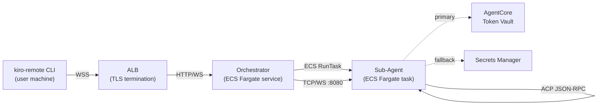
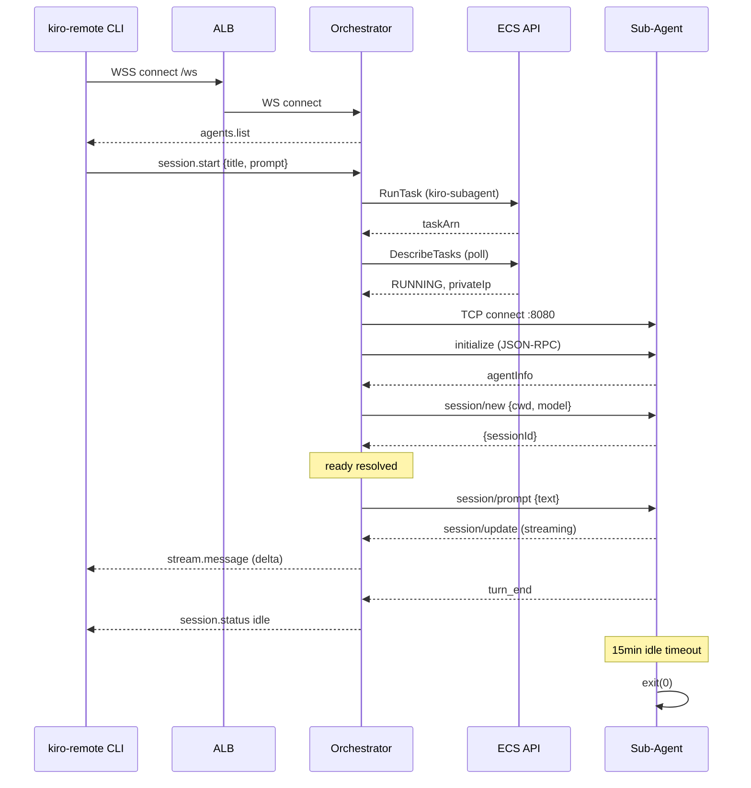

# Design Document: Remote Kiro ECS

## Overview

This design moves the Kiro Assistant orchestration from a local CDM to AWS ECS, enabling a stable, always-on deployment. The system has three tiers:

1. **Kiro Remote CLI** — a thin Node.js REPL client on the user's machine that connects via WebSocket to the Orchestrator.
2. **Orchestrator** — the existing Express + WebSocket server (`src/server/index.ts`) running as a long-lived ECS Fargate service behind an ALB. It manages sessions and dispatches work to Sub-Agent containers via the ECS RunTask API.
3. **Sub-Agent** — ephemeral ECS Fargate tasks running `kiro-cli acp` in server mode. Each handles a single session and self-terminates after idle timeout.

Authentication for kiro-cli inside Sub-Agent containers is bootstrapped by an enhanced `bootstrap-auth.sh` that retrieves OIDC credentials from AgentCore Identity Token Vault (primary) or AWS Secrets Manager (fallback), then populates the `auth_kv` table in kiro-cli's SQLite database before kiro-cli starts.

The POC scope proves the full chain: thin CLI → Orchestrator → single Sub-Agent on ECS.



## Architecture

### Component Topology

The system extends the existing codebase with minimal changes:

| Component | Existing Code | Changes |
|-----------|--------------|---------|
| CLI Client | `src/cli-client/kiro-remote.ts` | Add `--server` arg, reconnect logic, session creation via REST, polished event rendering |
| Express Server | `src/server/index.ts` | No changes — already has `/ws`, `/healthz`, `/api/sessions/health` |
| Session Handler | `src/server/session-handler.ts` | No changes — already routes events to RunnerManager |
| Runner Manager | `src/server/runner-manager.ts` | Already supports ECS runner via `ECS_RUNNER_ENABLED` env var toggle |
| ECS Runner | `src/server/ecs-runner.ts` | Replace stub with real ECS RunTask + ACP-over-TCP implementation |
| Agent Registry | `src/server/agent-registry.ts` | No changes — agent definitions remain the same |
| Auth Bootstrap | `scripts/bootstrap-auth.sh` | Add AgentCore Identity Token Vault as primary source before Secrets Manager fallback |
| Docker Image | `Dockerfile.kiro-cli` | No changes — already includes kiro-cli + bootstrap-auth.sh |
| Infrastructure | `infra/setup.sh` | Add ALB, ECS service definition, Sub-Agent security group rules |

### Key Design Decisions

**Decision 1: ACP over TCP instead of stdio**
The existing `createAcpRunner` communicates with kiro-cli via stdin/stdout pipes on a local child process. For ECS, the Sub-Agent runs in a separate container, so we need a network transport. The Sub-Agent will expose a TCP socket on port 8080 that speaks the same newline-delimited JSON-RPC protocol. The ECS Runner connects to this socket after the task reaches RUNNING state and the port is reachable.

*Rationale:* TCP is the simplest network transport that preserves the existing JSON-RPC framing. WebSocket adds unnecessary overhead for a point-to-point connection within a VPC. The ACP protocol is already newline-delimited JSON, which maps directly to a TCP stream.

**Decision 2: Task IP discovery via DescribeTasks**
After `RunTask` returns, the Orchestrator polls `DescribeTasks` until the task reaches RUNNING state, then reads the private IP from the task's network interface attachment. The ECS Runner connects to `<privateIp>:8080`.

*Rationale:* ECS Fargate tasks in `awsvpc` mode get their own ENI with a private IP. Service discovery (Cloud Map) adds complexity for ephemeral tasks. Polling DescribeTasks is simple and sufficient for POC scope.

**Decision 3: Auth bootstrap order — Token Vault → Secrets Manager → fail**
The `bootstrap-auth.sh` script tries AgentCore Identity Token Vault first (bound to ECS task workload identity), then falls back to Secrets Manager (IAM task role), then exits non-zero if both fail.

*Rationale:* Token Vault provides workload-identity-bound credentials with automatic rotation. Secrets Manager is a proven fallback that already works in the existing bootstrap script. The two-tier approach gives us security best practices with operational reliability.

**Decision 4: Ephemeral Sub-Agent lifecycle**
Each Sub-Agent handles exactly one session. It self-terminates after a configurable idle timeout (default 15 minutes). The Orchestrator can also force-stop it via `StopTask`. If a client reconnects to a terminated session, the Orchestrator launches a new Sub-Agent.

*Rationale:* Ephemeral containers are simpler than multiplexing sessions. ECS Fargate billing is per-second, so idle containers are cheap. This matches the existing RunnerManager's suspend/respawn pattern.

### Request Flow




## Components and Interfaces

### 1. ECS Runner (`src/server/ecs-runner.ts`)

Replaces the current stub with a real implementation that launches ECS tasks and communicates via ACP-over-TCP.

```typescript
// Public interface — same RunnerHandle as createAcpRunner
export function createEcsRunner(opts: {
  session: Session;
  model: string;
  agent: AgentDefinition;
  onEvent: (event: ServerEvent) => void;
  onSessionUpdate?: (updates: Partial<Session>) => void;
}): RunnerHandle;

// Internal: ECS task management
interface EcsTaskConfig {
  cluster: string;           // env: ECS_CLUSTER
  taskFamily: string;        // env: ECS_SUBAGENT_TASK_FAMILY
  subnets: string[];         // env: ECS_SUBAGENT_SUBNETS (comma-separated)
  securityGroup: string;     // env: ECS_SUBAGENT_SECURITY_GROUP
  containerPort: number;     // default: 8080
  startupTimeoutMs: number;  // default: 120_000
}

// Internal: launch and connect to a Sub-Agent
async function launchSubAgent(config: EcsTaskConfig, session: Session, model: string): Promise<{
  taskArn: string;
  privateIp: string;
}>;

// Internal: ACP-over-TCP connection
class AcpTcpConnection {
  constructor(host: string, port: number);
  connect(): Promise<void>;
  send(method: string, params: Record<string, unknown>): void;
  onMessage(handler: (msg: any) => void): void;
  close(): void;
}
```

The ECS Runner follows the same message handling logic as `createAcpRunner` in `src/server/runner.ts` (lines handling `session/update`, `turn_end`, `tool_call`, etc.) but replaces stdio pipes with a TCP socket.

### 2. ACP TCP Transport (`src/server/acp-tcp.ts`)

A new module that wraps a TCP socket with the same newline-delimited JSON-RPC framing used by the existing stdio transport.

```typescript
import { Socket } from 'node:net';

export class AcpTcpTransport {
  private socket: Socket;
  private buffer: string = '';
  private rpcId: number = 0;
  private responseHandlers: Map<number, { resolve: Function; reject: Function }>;

  constructor(host: string, port: number);

  /** Connect to the Sub-Agent's ACP endpoint. Rejects after timeoutMs. */
  connect(timeoutMs?: number): Promise<void>;

  /** Send a JSON-RPC request and return the response. */
  request(method: string, params?: Record<string, unknown>): Promise<any>;

  /** Send a JSON-RPC notification (no response expected). */
  notify(method: string, params?: Record<string, unknown>): void;

  /** Register a handler for incoming notifications (e.g., session/update). */
  onNotification(handler: (method: string, params: any) => void): void;

  /** Register a handler for connection close. */
  onClose(handler: (hadError: boolean) => void): void;

  /** Close the connection. */
  close(): void;
}
```

### 3. Enhanced Auth Bootstrap (`scripts/bootstrap-auth.sh`)

Extends the existing script with AgentCore Identity Token Vault as the primary credential source.

```bash
# Order of operations:
# 1. Skip if auth DB already exists
# 2. Try AgentCore Identity Token Vault (KIRO_TOKEN_VAULT_ENDPOINT)
# 3. Try Secrets Manager (KIRO_AUTH_SECRET_ARN) — existing logic
# 4. Try S3 (KIRO_AUTH_S3_URI) — existing logic
# 5. Try local file (KIRO_AUTH_FILE) — existing logic
# 6. Exit non-zero with descriptive error
```

The Token Vault integration uses the AgentCore Identity SDK (or HTTP API) to retrieve the `kirocli:oidc:device-registration` entry, then writes it into the `auth_kv` table using `sqlite3` CLI commands.

### 4. Kiro Remote CLI (`src/cli-client/kiro-remote.ts`)

Enhances the existing partial implementation with:

```typescript
// New capabilities:
// - --server argument for Orchestrator URL
// - Session creation via POST /api/sessions (REST)
// - Exponential backoff reconnection (1s → 30s)
// - /quit and /exit commands
// - Tool use display with ⚡ indicator
// - Streaming content display
// - Cross-platform (Node.js only, no native deps)

interface CliConfig {
  serverUrl: string;       // from --server arg
  maxReconnectAttempts: number;  // default: unlimited with backoff
  reconnectBaseMs: number;       // default: 1000
  reconnectMaxMs: number;        // default: 30000
}
```

### 5. Orchestrator Health Extension (`src/server/index.ts`)

The existing `/api/sessions/health` endpoint is extended to include ECS-specific information when `ECS_RUNNER_ENABLED=true`:

```typescript
// Extended health response when ECS mode is active
interface EcsHealthInfo {
  maxConcurrent: number;
  activeProcesses: number;
  sessions: Array<{
    id: string;
    state: string;
    idleSeconds: number | null;
    ecsTaskArn?: string;      // new: ECS task ARN
    ecsTaskState?: string;    // new: RUNNING, STOPPED, etc.
  }>;
}
```

### 6. Infrastructure (`infra/setup.sh`)

Extends the existing setup script with:
- ALB creation with HTTPS listener and WebSocket-compatible target group
- ECS service definition for the Orchestrator (desired count: 1)
- Updated security group rules for ALB → Orchestrator → Sub-Agent traffic
- CloudWatch log groups for both task types

## Data Models

### ECS Runner State

The ECS Runner maintains internal state per session, tracked within the `RunnerEntry` in `RunnerManager`:

```typescript
// Extended runner entry for ECS-backed sessions
interface EcsRunnerState {
  taskArn: string;              // ECS task ARN
  privateIp: string;            // Sub-Agent container IP
  transport: AcpTcpTransport;   // TCP connection to Sub-Agent
  acpSessionId: string | null;  // ACP session ID after handshake
  launchedAt: number;           // timestamp of RunTask call
  connectedAt: number | null;   // timestamp of TCP connection established
  runTaskLatencyMs: number | null; // time from RunTask to RUNNING state
}
```

### Environment Variables

| Variable | Component | Description | Default |
|----------|-----------|-------------|---------|
| `ECS_RUNNER_ENABLED` | Orchestrator | Toggle ECS runner vs local runner | `false` |
| `ECS_CLUSTER` | Orchestrator | ECS cluster name | `relay` |
| `ECS_SUBAGENT_TASK_FAMILY` | Orchestrator | Sub-Agent task definition family | `kiro-subagent` |
| `ECS_SUBAGENT_SUBNETS` | Orchestrator | Comma-separated subnet IDs | required |
| `ECS_SUBAGENT_SECURITY_GROUP` | Orchestrator | Security group for Sub-Agent tasks | required |
| `ECS_SUBAGENT_CONTAINER_PORT` | Orchestrator | Port Sub-Agent listens on | `8080` |
| `ECS_SUBAGENT_STARTUP_TIMEOUT_MS` | Orchestrator | Max wait for task to reach RUNNING | `120000` |
| `KIRO_MAX_SESSIONS` | Orchestrator | Max concurrent sessions | `5` |
| `KIRO_IDLE_TIMEOUT_MINUTES` | Orchestrator | Idle timeout before Sub-Agent shutdown | `15` |
| `KIRO_TOKEN_VAULT_ENDPOINT` | Sub-Agent | AgentCore Identity Token Vault URL | none |
| `KIRO_AUTH_SECRET_ARN` | Sub-Agent | Secrets Manager ARN for auth fallback | none |
| `KIRO_SESSION_ID` | Sub-Agent | Session ID passed from Orchestrator | required |
| `KIRO_MODEL` | Sub-Agent | Model selection passed from Orchestrator | none |
| `KIRO_CWD` | Sub-Agent | Working directory passed from Orchestrator | `/workspace` |
| `MIDWAY_COOKIE` | Sub-Agent | Midway cookie value (nice-to-have) | none |

### Auth KV Table Schema

The `auth_kv` table in kiro-cli's `data.sqlite3` stores OIDC credentials:

```sql
-- Existing schema in kiro-cli
CREATE TABLE IF NOT EXISTS auth_kv (
  key TEXT PRIMARY KEY,
  value TEXT NOT NULL
);

-- Keys written by bootstrap-auth.sh:
-- 'kirocli:oidc:device-registration' → JSON {client_id, client_secret, refresh_token, ...}
-- Short-lived access/refresh tokens are derived by kiro-cli at runtime
```

### ACP Protocol Messages

The ACP JSON-RPC protocol used between Orchestrator and Sub-Agent (same as existing stdio protocol):

```
→ initialize {protocolVersion, clientCapabilities, clientInfo}
← {agentInfo}
→ session/new {cwd, model, mcpServers}
← {sessionId}
→ session/prompt {sessionId, prompt: [{type: "text", text}]}
← session/update {update: {sessionUpdate: "agent_message_chunk", content: {type, text}}}
← session/update {update: {sessionUpdate: "tool_call", title, toolName}}
← session/update {update: {sessionUpdate: "turn_end"}}
→ session/cancel {sessionId}
```

