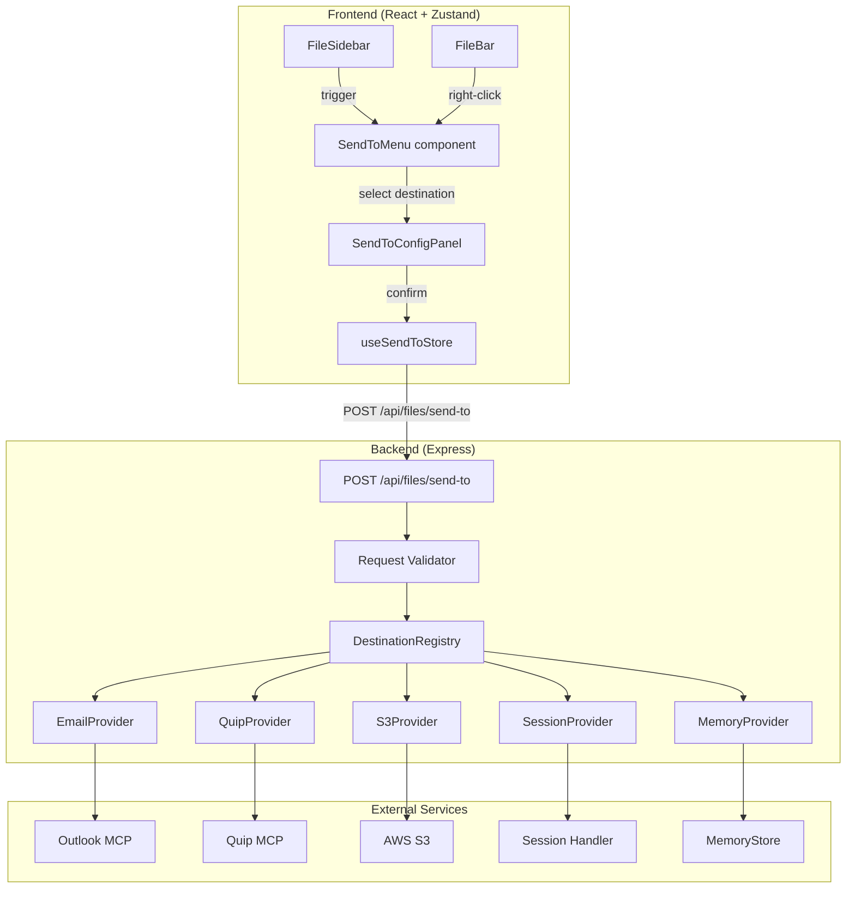
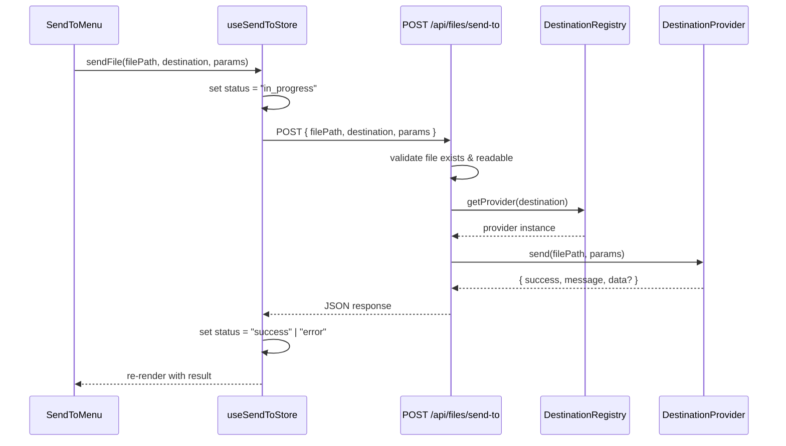

# Design Document: Send To

## Overview

The Send To feature adds a pluggable file-sharing mechanism to the Kiro Assistant web app. Users can route files — created or accessed by agents — to external destinations directly from the FileSidebar or FileBar. Destinations include Email (Outlook MCP), Quip (Quip MCP), S3 (AWS SDK), system Clipboard, another agent Session, and Memory (from the shared-memories spec).

The architecture follows a provider pattern: each destination implements a common `DestinationProvider` interface and registers with a central `DestinationRegistry`. The server exposes a single `POST /api/files/send-to` endpoint that validates the request and delegates to the appropriate provider. The UI renders a Send To dropdown menu populated from the registry, with destination-specific configuration panels.

### Key Design Decisions

1. **Server-side provider execution** — All send operations (except Clipboard) execute on the server where filesystem access, SDK credentials, and MCP tool invocations reside. The client sends a `Send_To_Request` and receives a result. Clipboard is the exception — it uses the browser Clipboard API directly on the client.
2. **Pluggable registry pattern** — Providers register themselves with a `DestinationRegistry` at server startup. Adding a new destination means creating a provider file and registering it — no changes to existing code or UI components.
3. **MCP tool invocation for Email/Quip** — Rather than implementing SMTP or Quip API calls directly, the Email and Quip providers invoke the existing MCP server tools through the agent's tool-use mechanism. This reuses the user's configured credentials and avoids duplicating auth logic.
4. **File type filtering** — Each provider declares which file types it supports (`text`, `binary`, or `all`). The UI disables providers that don't match the current file, preventing invalid operations before they reach the server.
5. **Single concurrent send per file** — The UI enforces one active send operation per file to avoid race conditions and duplicate sends. The Send To button is disabled while a send is in progress.
6. **Context menu on FileBar** — Right-clicking a file chip in the FileBar opens a context menu with Send To as a submenu, providing a shortcut that doesn't require opening the FileSidebar.

## Architecture



### Request Flow: Send To Operation



## Components and Interfaces

### Shared Types (`src/shared/send-to-types.ts`)

```typescript
export interface DestinationInfo {
  id: string;
  label: string;
  icon: string;
  supportedFileTypes: "text" | "binary" | "all";
  configFields: ConfigField[];
}

export interface ConfigField {
  name: string;
  label: string;
  type: "text" | "email" | "textarea" | "select";
  required: boolean;
  placeholder?: string;
  options?: { value: string; label: string }[];
}

export interface SendToRequest {
  filePath: string;
  destination: string;
  params: Record<string, string>;
}

export interface SendToResponse {
  success: boolean;
  message: string;
  data?: Record<string, unknown>;
}

export type SendToStatus = "idle" | "in_progress" | "success" | "error";


// File type classification helper
export const TEXT_EXTENSIONS = new Set([
  'txt','md','py','js','ts','tsx','jsx','json','xml','html','css',
  'scss','yaml','yml','sh','bash','c','cpp','h','java','go','rs',
  'rb','php','sql','vue','svelte','toml','ini','csv','log','graphql'
]);

export function isTextFile(extension: string): boolean {
  return TEXT_EXTENSIONS.has(extension.toLowerCase());
}
```

### Server Components

#### DestinationProvider Interface (`src/server/send-to/destination-provider.ts`)

```typescript
export interface DestinationProvider {
  readonly id: string;
  readonly label: string;
  readonly icon: string;
  readonly supportedFileTypes: "text" | "binary" | "all";

  getConfigFields(): ConfigField[];
  validateParams(params: Record<string, string>): string | null; // returns error message or null
  send(filePath: string, params: Record<string, string>): Promise<SendToResponse>;
}
```

#### DestinationRegistry (`src/server/send-to/destination-registry.ts`)

Central registry that holds all registered providers. Initialized at server startup.

```typescript
export class DestinationRegistry {
  private providers = new Map<string, DestinationProvider>();

  register(provider: DestinationProvider): void;
  get(id: string): DestinationProvider | undefined;
  getAll(): DestinationInfo[];
  has(id: string): boolean;
  getAvailableIds(): string[];
}
```

The registry is instantiated once in `src/server/send-to/index.ts` and all built-in providers are registered there:

```typescript
import { DestinationRegistry } from "./destination-registry.js";
import { EmailProvider } from "./providers/email-provider.js";
import { QuipProvider } from "./providers/quip-provider.js";
import { S3Provider } from "./providers/s3-provider.js";
import { ClipboardProvider } from "./providers/clipboard-provider.js";
import { SessionProvider } from "./providers/session-provider.js";
import { MemoryProvider } from "./providers/memory-provider.js";

export function createSendToRegistry(): DestinationRegistry {
  const registry = new DestinationRegistry();
  registry.register(new EmailProvider());
  registry.register(new QuipProvider());
  registry.register(new S3Provider());
  registry.register(new ClipboardProvider());
  registry.register(new SessionProvider());
  registry.register(new MemoryProvider());
  return registry;
}
```

#### Send To Route (`src/server/send-to/send-to-routes.ts`)

Express router mounted at `/api/files/send-to`.

```typescript
// POST /api/files/send-to
// Body: SendToRequest { filePath, destination, params }
// Response: SendToResponse { success, message, data? }

// GET /api/files/send-to/destinations
// Response: DestinationInfo[]
```

The route handler:
1. Validates `filePath` exists and is readable (`fs.access`)
2. Looks up the destination in the registry
3. Validates `params` via `provider.validateParams()`
4. Calls `provider.send(filePath, params)`
5. Returns the `SendToResponse`

#### Provider Implementations

**EmailProvider** (`src/server/send-to/providers/email-provider.ts`)
- Config fields: `to` (email, required), `subject` (text, required), `body` (textarea, optional)
- Reads the file content, invokes the Outlook MCP `send_email` tool with the file as an attachment
- Checks MCP availability before attempting send; returns descriptive error if Outlook MCP is not configured
- `supportedFileTypes: "all"` — supports both text and binary attachments

**QuipProvider** (`src/server/send-to/providers/quip-provider.ts`)
- Config fields: `folderUrl` (text, required — Quip folder or document URL)
- Invokes the Quip MCP `create_document` or `upload_file` tool
- Returns a clickable link to the created Quip document on success
- Checks MCP availability; returns error with setup guidance if Quip MCP is not configured
- `supportedFileTypes: "all"`

**S3Provider** (`src/server/send-to/providers/s3-provider.ts`)
- Config fields: `bucket` (text, required), `keyPrefix` (text, optional — defaults to file name)
- Uses `@aws-sdk/client-s3` `PutObjectCommand` to upload the file
- Returns the S3 URI (`s3://bucket/key`) as copyable data on success
- Returns AWS error code and message on failure
- `supportedFileTypes: "all"`

**ClipboardProvider** (`src/server/send-to/providers/clipboard-provider.ts`)
- No config fields — immediate action
- Server-side: reads the file content as UTF-8 text and returns it in `data.content`
- Client-side: the `useSendToStore` intercepts clipboard destination, reads the returned content, and calls `navigator.clipboard.writeText()`
- `supportedFileTypes: "text"` — disabled for binary files in the UI

**SessionProvider** (`src/server/send-to/providers/session-provider.ts`)
- Config fields: `sessionId` (select, required — populated dynamically from active sessions)
- Sends a `session.continue` event to the target session with the file path as context in the prompt
- Returns confirmation with the target session title
- If no other sessions are active, the config panel shows a message instead of the selector
- `supportedFileTypes: "all"`

**MemoryProvider** (`src/server/send-to/providers/memory-provider.ts`)
- Config fields: `category` (select, optional — from `MEMORY_CATEGORIES`), `content` (textarea, optional — defaults to file content summary)
- Creates a new memory entry via the `IMemoryStore` from the shared-memories spec with `sourceType: "send-to"`
- `supportedFileTypes: "text"` — only text files can be meaningfully stored as memories

### Frontend Components

#### useSendToStore (`src/ui/store/useSendToStore.ts`)

Dedicated Zustand store for send-to state. Keeps it separate from `useAppStore`.

```typescript
interface SendToState {
  status: SendToStatus;
  activeDestination: string | null;
  result: SendToResponse | null;
  destinations: DestinationInfo[];
  menuOpen: boolean;
  configPanelOpen: boolean;
  targetFile: CreatedFile | null;

  fetchDestinations(): Promise<void>;
  openMenu(file: CreatedFile): void;
  closeMenu(): void;
  selectDestination(id: string): void;
  sendFile(filePath: string, destination: string, params: Record<string, string>): Promise<void>;
  reset(): void;
}
```

#### SendToMenu (`src/ui/components/SendToMenu.tsx`)

Dropdown menu component that lists available destinations. Rendered as a Radix `DropdownMenu` (already a project dependency via `@radix-ui/react-dropdown-menu`).

- Receives the current file's extension to determine which destinations are enabled/disabled
- Each menu item shows the destination icon, label, and a disabled tooltip if the file type doesn't match
- Selecting a destination opens the `SendToConfigPanel`

#### SendToConfigPanel (`src/ui/components/SendToConfigPanel.tsx`)

Modal or popover that renders the destination-specific config fields. Uses the `configFields` from `DestinationInfo` to dynamically generate form inputs.

- Renders a form with fields from `getConfigFields()`
- For the Session destination, fetches active sessions and populates the select dropdown
- Shows a "Send" button that triggers `useSendToStore.sendFile()`
- Displays progress spinner, success message, or error with retry button based on `status`

#### SendToStatusIndicator (`src/ui/components/SendToStatusIndicator.tsx`)

Inline status display shown in the FileSidebar header during/after a send operation.

- `in_progress`: spinner + "Sending to {destination}..."
- `success`: green checkmark + destination-specific details (S3 URI, Quip link, etc.) — auto-dismisses after 5 seconds
- `error`: red icon + error message + "Retry" button

#### FileBar Context Menu Integration

The existing `FileChip` component in `FileBar.tsx` gets an `onContextMenu` handler that opens a Radix `ContextMenu` with:
- "Open" — existing `onFileClick` behavior
- "Preview" — opens preview in new tab
- "Download" — triggers download
- "Send To ▸" — submenu listing destinations, same as `SendToMenu`

Selecting a destination from the context menu opens the `SendToConfigPanel` in a modal (since there's no FileSidebar anchor).

## Data Models

### SendToRequest (Client → Server)

```typescript
{
  filePath: string;       // absolute path to the file on the server filesystem
  destination: string;    // provider ID: "email" | "quip" | "s3" | "clipboard" | "session" | "memory"
  params: {               // destination-specific parameters
    // Email: { to, subject, body? }
    // Quip: { folderUrl }
    // S3: { bucket, keyPrefix? }
    // Clipboard: {} (empty)
    // Session: { sessionId }
    // Memory: { category?, content? }
    [key: string]: string;
  }
}
```

### SendToResponse (Server → Client)

```typescript
{
  success: boolean;
  message: string;        // human-readable result or error description
  data?: {
    // Email: { messageId? }
    // Quip: { url: string }
    // S3: { uri: string, bucket: string, key: string }
    // Clipboard: { content: string }  // file text content for client-side clipboard write
    // Session: { sessionId: string, sessionTitle: string }
    // Memory: { memoryId: string }
    [key: string]: unknown;
  }
}
```

### DestinationInfo (Server → Client, for menu population)

```typescript
{
  id: string;                          // "email", "quip", "s3", "clipboard", "session", "memory"
  label: string;                       // "Email (Outlook)", "Quip", "S3", "Clipboard", "Session", "Memory"
  icon: string;                        // emoji or icon identifier: "📧", "📝", "☁️", "📋", "🔗", "🧠"
  supportedFileTypes: "text" | "binary" | "all";
  configFields: ConfigField[];         // dynamic form field definitions
}
```

### Provider Config Fields by Destination

| Destination | Fields | Types |
|-------------|--------|-------|
| Email | `to` (email, required), `subject` (text, required), `body` (textarea, optional) | all |
| Quip | `folderUrl` (text, required) | all |
| S3 | `bucket` (text, required), `keyPrefix` (text, optional) | all |
| Clipboard | _(none)_ | text |
| Session | `sessionId` (select, required) | all |
| Memory | `category` (select, optional), `content` (textarea, optional) | text |


## Correctness Properties

*A property is a characteristic or behavior that should hold true across all valid executions of a system — essentially, a formal statement about what the system should do. Properties serve as the bridge between human-readable specifications and machine-verifiable correctness guarantees.*

### Property 1: Registry maintains unique provider IDs

*For any* sequence of `DestinationProvider` registrations with distinct `id` values, the registry's `getAll()` shall return exactly one entry per registered ID, and `get(id)` shall return the correct provider for each ID.

**Validates: Requirements 2.1, 2.3**

### Property 2: File type filtering correctness

*For any* `DestinationProvider` with `supportedFileTypes` set to `"text"` and *any* file extension that is not in the `TEXT_EXTENSIONS` set, the UI shall mark that destination as disabled. Conversely, for any text file extension and a provider with `supportedFileTypes` of `"text"` or `"all"`, the destination shall be enabled.

**Validates: Requirements 2.4, 6.3**

### Property 3: S3 URI format

*For any* valid S3 bucket name and key string, the S3 provider's success response shall contain a `data.uri` field matching the pattern `s3://{bucket}/{key}`.

**Validates: Requirements 5.4**

### Property 4: Session list excludes current session

*For any* set of active sessions and a current session ID that exists in that set, the Session provider's session list shall contain all sessions except the one matching the current session ID.

**Validates: Requirements 7.1**

### Property 5: Send button disabled during in-progress operation

*For any* `SendToState` where `status` is `"in_progress"`, the Send To button's disabled state shall be `true`. For any state where `status` is `"idle"` and the file is valid (not `__not_found__`), the button shall be enabled.

**Validates: Requirements 8.4**

### Property 6: Server rejects invalid requests before provider delegation

*For any* `SendToRequest` where the `filePath` does not exist on the filesystem, the server shall respond with HTTP 404 without invoking any provider. *For any* `SendToRequest` where the `destination` string is not a registered provider ID, the server shall respond with HTTP 400 and the response body shall contain the list of available destination IDs.

**Validates: Requirements 9.2, 9.3, 9.4**

### Property 7: Response structure invariant

*For any* completed send operation (success or failure), the server response shall contain a `success` boolean and a `message` string. When `success` is `true`, the `message` shall be non-empty.

**Validates: Requirements 9.5**

### Property 8: Provider parameter validation

*For any* `DestinationProvider` and *any* `params` object missing a required field (as defined by `getConfigFields()` where `required` is `true`), `validateParams(params)` shall return a non-null error string. *For any* `params` object containing all required fields, `validateParams(params)` shall return `null`.

**Validates: Requirements 3.1, 4.1, 5.1**

## Error Handling

### Server-Side Errors

| Scenario | HTTP Status | Response |
|----------|-------------|----------|
| Missing `filePath` in request body | 400 | `{ success: false, message: "filePath is required" }` |
| Missing `destination` in request body | 400 | `{ success: false, message: "destination is required" }` |
| File does not exist or is not readable | 404 | `{ success: false, message: "File not found: {filePath}" }` |
| Unknown destination ID | 400 | `{ success: false, message: "Unknown destination: {id}. Available: email, quip, s3, clipboard, session, memory" }` |
| Provider parameter validation failure | 400 | `{ success: false, message: "{validation error from provider}" }` |
| Outlook MCP not configured | 502 | `{ success: false, message: "Outlook MCP is not configured. Enable it in Settings → MCP Servers." }` |
| Quip MCP not configured | 502 | `{ success: false, message: "Quip MCP is not configured. Enable it in Settings → MCP Servers." }` |
| AWS credentials missing or S3 upload failure | 502 | `{ success: false, message: "S3 upload failed: {AWS error code} — {AWS error message}" }` |
| Target session not found | 404 | `{ success: false, message: "Target session not found" }` |
| Internal server error (unexpected) | 500 | `{ success: false, message: "Internal error: {error message}" }` |

### Client-Side Error Handling

- **Network failure**: `useSendToStore` catches fetch errors, sets `status: "error"` and `result.message` to a network error description. The `SendToStatusIndicator` shows the error with a Retry button.
- **Clipboard API unavailable**: If `navigator.clipboard.writeText()` throws (e.g., insecure context, permission denied), the store catches the error and displays "Clipboard access denied. Try using HTTPS or check browser permissions."
- **Empty session list**: When the Session provider config panel detects no other active sessions, it renders a message "No other active sessions available" instead of an empty select dropdown, and disables the Send button.
- **File not found state**: When `content === '__not_found__'`, the Send To button is disabled with a tooltip "File not available — the agent may not have created it yet." This prevents the user from attempting to send a non-existent file.

### Retry Behavior

- The Retry button in the error state re-invokes `sendFile()` with the same parameters.
- No automatic retry — all retries are user-initiated.
- The error state persists until the user clicks Retry, closes the menu, or starts a new send operation.

## Testing Strategy

### Unit Tests (vitest)

Unit tests cover specific examples, edge cases, and integration points:

- **DestinationRegistry**: Registration, retrieval by ID, `getAll()` returns correct list, duplicate ID handling, `get()` for non-existent ID returns undefined.
- **Provider validateParams**: Each provider with specific valid/invalid param combinations. Email with missing `to`, S3 with missing `bucket`, etc.
- **Send To Route**: HTTP 404 for non-existent file, HTTP 400 for unknown destination, HTTP 400 for missing required fields, successful response shape.
- **S3 URI construction**: Specific bucket/key combinations including edge cases (keys with slashes, special characters).
- **File type classification**: Specific extensions mapped to text/binary, edge cases (unknown extensions, empty string, uppercase).
- **ClipboardProvider**: Returns file content in `data.content` for text files.
- **SessionProvider**: Filters out current session from active session list, handles empty session list.
- **MemoryProvider**: Creates memory with `sourceType: "send-to"`, correct category mapping.

### Property-Based Tests (fast-check)

The project uses `fast-check` as the property-based testing library (already specified in the shared-memories spec, compatible with vitest).

Each correctness property maps to a single property-based test with a minimum of 100 iterations. Each test is tagged with a comment referencing the design property.

```typescript
// Feature: send-to, Property 1: Registry maintains unique provider IDs
test.prop([providerListArb], (providers) => {
  const registry = new DestinationRegistry();
  for (const p of providers) registry.register(p);
  const all = registry.getAll();
  expect(all.length).toBe(providers.length);
  for (const p of providers) {
    expect(registry.get(p.id)).toBeDefined();
  }
});
```

**Generators needed:**
- `destinationProviderArb`: Generates mock `DestinationProvider` objects with random `id`, `label`, `icon`, random `supportedFileTypes`, and random config fields.
- `providerListArb`: Generates arrays of `DestinationProvider` objects with distinct IDs.
- `fileExtensionArb`: Generates random file extensions, both from the known text set and random strings for binary.
- `sendToRequestArb`: Generates valid `SendToRequest` objects with random file paths, destination IDs, and params.
- `s3ParamsArb`: Generates random S3 bucket names (valid S3 naming rules) and key prefixes.
- `sessionListArb`: Generates arrays of session info objects with distinct IDs.
- `configParamsArb`: Generates `Record<string, string>` objects with random subsets of required/optional fields for a given provider.

**Property test files:**
- `src/server/send-to/destination-registry.test.ts` — Properties 1, 2
- `src/server/send-to/send-to-routes.test.ts` — Properties 6, 7, 8
- `src/server/send-to/providers/s3-provider.test.ts` — Property 3
- `src/server/send-to/providers/session-provider.test.ts` — Property 4
- `src/ui/store/useSendToStore.test.ts` — Property 5

### Test Configuration

`fast-check` should already be installed as a dev dependency from the shared-memories spec. If not:

```bash
npm install --save-dev fast-check
```

Tests run via the existing vitest setup (`npm test` / `vitest run`). No additional configuration needed.
