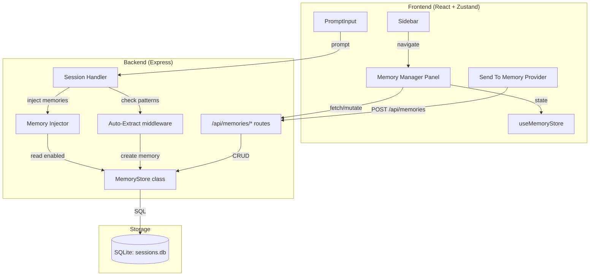
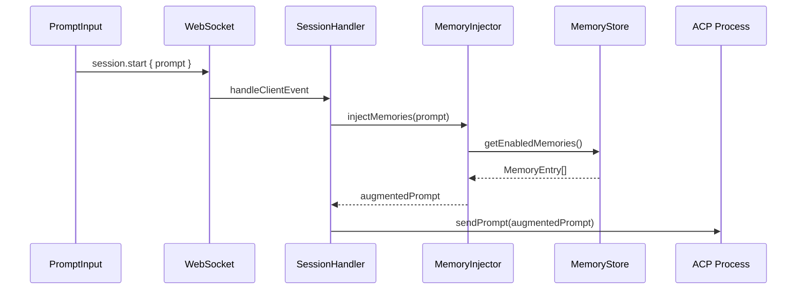

# Design Document: Shared Memories

## Overview

The Shared Memories feature adds a persistent, cross-session knowledge base to the Kiro Assistant web app. It introduces a `memories` table in the existing SQLite database (`~/.kiro-assistant/sessions.db`), a REST API for CRUD operations, automatic memory injection into new sessions, a Memory Manager UI panel, agent auto-extraction of memories from user directives, and a "Send To Memory" destination provider for the planned Send To feature.

The design follows the existing architectural patterns: Express REST endpoints on the server, a Zustand store slice on the frontend, and shared TypeScript types in `src/shared/`. The memory store reuses the same `better-sqlite3` database instance and initialization pattern established by `SessionStore`.

### Key Design Decisions

1. **Pluggable storage backend** — The memory store is defined as a TypeScript interface (`IMemoryStore`). The default implementation uses SQLite (same `sessions.db` file), but the interface is designed to be swappable for cloud backends like AWS Bedrock AgentCore Memory. A `MEMORY_BACKEND` env var selects the implementation at startup (`sqlite` default, `agentcore` future).
2. **SQLite as default backend** — Memories live in the existing `sessions.db` file alongside sessions and messages. Zero additional infrastructure, works offline, fast local reads for injection.
3. **REST over WebSocket for CRUD** — Memory operations are request/response (not streaming), so REST endpoints are a better fit than WebSocket events. This matches the existing pattern for settings, model config, and file operations.
4. **Prompt prepending for injection** — Memories are injected by prepending a formatted text block to the user's initial prompt, not by modifying the system prompt or agent configuration. This is the simplest approach that works with both Kiro CLI and Claude Code CLI agents.
5. **Eager loading with client-side filtering** — The Memory Manager fetches all memories on open and filters/searches client-side. With a 2000-char-per-entry limit and an 8000-char context budget, the total dataset stays small enough that server-side pagination is unnecessary.
6. **Pattern-based auto-extraction** — Agent memory extraction uses regex pattern matching on user prompts (e.g., "remember that...", "save to memory:...") rather than LLM-based extraction. This is deterministic, fast, and doesn't consume additional tokens.

## Architecture



### Request Flow: Memory Injection



## Components and Interfaces

### Server Components

#### MemoryStore (`src/server/memory-store.ts`)

Defines the `IMemoryStore` interface and the default SQLite implementation. All consumers (API routes, injector, auto-extract) depend on the interface, not the concrete class. The backend is selected at startup via `MEMORY_BACKEND` env var.

```typescript
// Interface — all backends implement this
export interface IMemoryStore {
  create(entry: CreateMemoryInput): MemoryEntry;
  getById(id: string): MemoryEntry | undefined;
  list(filter?: { category?: string; search?: string }): MemoryEntry[];
  update(id: string, updates: UpdateMemoryInput): MemoryEntry | undefined;
  delete(id: string): boolean;
  getEnabled(): MemoryEntry[];
  getTotalEnabledSize(): number;
}

// SQLite implementation (default)
export class SqliteMemoryStore implements IMemoryStore {
  constructor(dbPath: string);
  // ... implements all IMemoryStore methods using better-sqlite3
}

// Future: AgentCore implementation
// export class AgentCoreMemoryStore implements IMemoryStore {
//   constructor(config: { region: string; agentId: string });
//   // ... implements all IMemoryStore methods using AgentCore Memory API
// }

// Factory function
export function createMemoryStore(): IMemoryStore {
  const backend = process.env.MEMORY_BACKEND ?? "sqlite";
  if (backend === "sqlite") return new SqliteMemoryStore(DB_PATH);
  // if (backend === "agentcore") return new AgentCoreMemoryStore({ ... });
  throw new Error(`Unknown memory backend: ${backend}`);
}
```

#### Memory API Routes (`src/server/memory-routes.ts`)

Express router mounted at `/api/memories`. Thin layer that validates input and delegates to `MemoryStore`.

| Method | Path | Description |
|--------|------|-------------|
| GET | `/api/memories` | List all memories, optional `?category=` and `?search=` query params |
| POST | `/api/memories` | Create a new memory entry |
| PUT | `/api/memories/:id` | Partial update (content, category, enabled) |
| DELETE | `/api/memories/:id` | Delete a memory entry |

#### Memory Injector (`src/server/memory-injector.ts`)

Pure function that formats enabled memories into a context block and prepends it to the user prompt.

```typescript
export function buildMemoryContext(memories: MemoryEntry[], budget?: number): string;
export function injectMemories(prompt: string, store: IMemoryStore, budget?: number): string;
```

#### Auto-Extract Middleware (in `src/server/session-handler.ts`)

Pattern matching logic added to the existing `handleClientEvent` function. Checks incoming prompts for memory directives before forwarding to the agent.

### Frontend Components

#### useMemoryStore (`src/ui/store/useMemoryStore.ts`)

Dedicated Zustand store for memory state. Keeps memory state separate from the main app store to avoid bloating `useAppStore`.

```typescript
interface MemoryState {
  memories: MemoryEntry[];
  loading: boolean;
  error: string | null;
  searchQuery: string;
  selectedCategories: Set<string>;
  editingId: string | null;

  fetchMemories(): Promise<void>;
  createMemory(input: CreateMemoryInput): Promise<MemoryEntry>;
  updateMemory(id: string, updates: UpdateMemoryInput): Promise<void>;
  deleteMemory(id: string): Promise<void>;
  setSearchQuery(query: string): void;
  toggleCategory(category: string): void;
}
```

#### MemoryManager (`src/ui/components/MemoryManager.tsx`)

Main panel component. Renders the memory list, search bar, category filters, creation form, and context budget indicator.

#### MemoryCard (`src/ui/components/MemoryCard.tsx`)

Individual memory entry display with content preview, category badge, source badge, enabled toggle, edit/delete actions, and session link.

#### MemoryForm (`src/ui/components/MemoryForm.tsx`)

Shared form component used for both creation and editing. Contains content textarea with character counter and category selector.

### Shared Types (`src/shared/memory-types.ts`)

```typescript
export interface MemoryEntry {
  id: string;
  content: string;
  category: string;
  sourceType: "manual" | "agent" | "send-to";
  sourceSessionId: string | null;
  enabled: boolean;
  createdAt: number;
  updatedAt: number;
}

export interface CreateMemoryInput {
  content: string;
  category?: string;
  sourceType: "manual" | "agent" | "send-to";
  sourceSessionId?: string;
}

export interface UpdateMemoryInput {
  content?: string;
  category?: string;
  enabled?: boolean;
}

export const MEMORY_CATEGORIES = [
  "preferences",
  "project-context",
  "decisions",
  "people",
  "general",
] as const;

export type MemoryCategory = (typeof MEMORY_CATEGORIES)[number];

export const MAX_MEMORY_CONTENT_LENGTH = 2000;
export const DEFAULT_CONTEXT_BUDGET = 8000;
export const CONTEXT_BUDGET_WARNING_THRESHOLD = 0.8;
```

## Data Models

### SQLite Schema

```sql
CREATE TABLE IF NOT EXISTS memories (
  id          TEXT PRIMARY KEY,
  content     TEXT NOT NULL,
  category    TEXT NOT NULL DEFAULT 'general',
  source_type TEXT NOT NULL,
  source_session_id TEXT,
  enabled     INTEGER NOT NULL DEFAULT 1,
  created_at  INTEGER NOT NULL,
  updated_at  INTEGER NOT NULL
);

CREATE INDEX IF NOT EXISTS idx_memories_category ON memories(category);
CREATE INDEX IF NOT EXISTS idx_memories_enabled ON memories(enabled);
CREATE INDEX IF NOT EXISTS idx_memories_created_at ON memories(created_at);
```

The table is created in the existing `sessions.db` database during `MemoryStore` initialization, following the same `CREATE TABLE IF NOT EXISTS` pattern used by `SessionStore.initialize()`.

### Field Mapping (DB ↔ API)

| Database Column | API Field | Type |
|----------------|-----------|------|
| `id` | `id` | `string` (UUID v4) |
| `content` | `content` | `string` (max 2000 chars) |
| `category` | `category` | `string` (default: "general") |
| `source_type` | `sourceType` | `"manual" \| "agent" \| "send-to"` |
| `source_session_id` | `sourceSessionId` | `string \| null` |
| `enabled` | `enabled` | `boolean` (DB: 0/1 integer) |
| `created_at` | `createdAt` | `number` (epoch ms) |
| `updated_at` | `updatedAt` | `number` (epoch ms) |

### Serialization

The `MemoryStore` handles the conversion between snake_case database columns and camelCase API fields:

- **Serialize (DB → API)**: `enabled` integer (0/1) → boolean, snake_case → camelCase
- **Deserialize (API → DB)**: boolean → integer, camelCase → snake_case

### Memory Context Format (Injection)

When memories are injected into a session prompt, they are formatted as:

```
## Shared Memories

The following are persistent memories from previous sessions. Use them as context.

- [preferences] User prefers TypeScript over JavaScript
- [decisions] We decided to use PostgreSQL for the production database
- [project-context] The API gateway runs on port 8080

---

{original user prompt}
```

Memories are included newest-first until the 8000-character context budget is reached. The budget applies to the formatted memory block only, not the user's prompt.


## Correctness Properties

*A property is a characteristic or behavior that should hold true across all valid executions of a system — essentially, a formal statement about what the system should do. Properties serve as the bridge between human-readable specifications and machine-verifiable correctness guarantees.*

### Property 1: Memory serialization round-trip

*For any* valid `MemoryEntry` object, serializing it to a JSON API response (camelCase fields, boolean `enabled`) and then deserializing back to a `MemoryEntry` (mapping to snake_case DB columns and integer `enabled`) shall produce an object equivalent to the original.

**Validates: Requirements 2.2, 10.1, 10.2, 10.3**

### Property 2: Unique ID generation

*For any* number N of memories created via `MemoryStore.create()`, all N resulting `id` values shall be distinct strings.

**Validates: Requirements 1.3**

### Property 3: List sort order invariant

*For any* set of memories in the store, `GET /api/memories` shall return them sorted by `createdAt` in descending order (newest first).

**Validates: Requirements 2.1**

### Property 4: Partial update preserves unchanged fields

*For any* existing `MemoryEntry` and any valid partial update containing a subset of `{ content, category, enabled }`, applying the update via `MemoryStore.update()` shall change only the specified fields and leave all other fields (except `updatedAt`) unchanged.

**Validates: Requirements 2.3**

### Property 5: Delete removes entry

*For any* existing `MemoryEntry`, after calling `MemoryStore.delete(id)`, calling `MemoryStore.getById(id)` shall return `undefined`.

**Validates: Requirements 2.4**

### Property 6: Filter correctness

*For any* set of memories and any combination of category filter and search substring, all entries returned by `MemoryStore.list({ category, search })` shall (a) match the specified category if provided, and (b) contain the search substring case-insensitively if provided. Additionally, no entry matching both criteria shall be excluded from the results.

**Validates: Requirements 2.7, 4.3, 4.4**

### Property 7: Injection includes only enabled memories within budget

*For any* set of memories with mixed `enabled` states and any positive context budget, `buildMemoryContext()` shall (a) include only memories where `enabled === true`, (b) include them in reverse chronological order (newest first), and (c) produce a formatted block whose character length does not exceed the budget.

**Validates: Requirements 3.1, 3.3, 8.4**

### Property 8: Injection format structure

*For any* non-empty list of enabled memories and any user prompt, `injectMemories(prompt, store)` shall produce a string that starts with the `## Shared Memories` header and ends with the original user prompt, with the original prompt appearing exactly once and unmodified.

**Validates: Requirements 3.2**

### Property 9: Content length enforcement

*For any* string longer than 2000 characters, `MemoryStore.create()` and `MemoryStore.update()` shall reject the input (throw or return an error). *For any* string of 2000 characters or fewer, the operation shall succeed.

**Validates: Requirements 8.1, 8.2**

### Property 10: Source type validation

*For any* string that is not one of `"manual"`, `"agent"`, or `"send-to"`, `MemoryStore.create()` shall reject the input. *For any* of the three valid values, creation shall succeed.

**Validates: Requirements 1.2**

### Property 11: Auto-extraction round-trip

*For any* non-empty content string of 5 or more characters, wrapping it in each directive pattern (`"remember that {content}"`, `"save to memory: {content}"`, `"remember: {content}"`) and then running the extraction parser shall yield the original content string.

**Validates: Requirements 6.1, 6.2, 6.4**

### Property 12: Context usage calculation

*For any* set of memories with known content lengths and any context budget, the computed context usage percentage shall equal the sum of enabled memory content lengths divided by the budget, and the warning flag shall be `true` if and only if that percentage exceeds 0.8.

**Validates: Requirements 4.8, 8.5**

## Error Handling

### Server-Side Errors

| Scenario | HTTP Status | Response |
|----------|-------------|----------|
| POST `/api/memories` missing `content` | 400 | `{ error: "content is required" }` |
| POST `/api/memories` missing `sourceType` | 400 | `{ error: "sourceType is required" }` |
| POST/PUT with `content` > 2000 chars | 400 | `{ error: "content exceeds maximum length of 2000 characters" }` |
| POST with invalid `sourceType` | 400 | `{ error: "sourceType must be one of: manual, agent, send-to" }` |
| PUT/DELETE with non-existent `id` | 404 | `{ error: "memory not found" }` |
| SQLite write failure | 500 | `{ error: "internal server error" }` |

### Client-Side Errors

- **Empty content submission**: The `MemoryForm` component validates content is non-empty (after trimming) before enabling the submit button. A validation message is shown inline.
- **Network failures**: The `useMemoryStore` sets an `error` state string on fetch/mutation failures. The `MemoryManager` displays a dismissible error banner.
- **Optimistic update rollback**: Toggle operations (enabled/disabled) apply optimistically in the Zustand store. If the API call fails, the store reverts to the previous state and shows an error toast.

### Auto-Extraction Edge Cases

- Extracted content shorter than 5 characters is silently ignored (no memory created, no error emitted).
- If the memory API call fails during auto-extraction, the session handler logs the error but does not interrupt the user's session flow. A warning is logged server-side.

## Testing Strategy

### Unit Tests (vitest)

Unit tests cover specific examples, edge cases, and integration points:

- **MemoryStore**: Table creation, CRUD operations with specific inputs, edge cases (empty content, max-length content, duplicate IDs, invalid source types, non-existent IDs).
- **Memory Injector**: Empty memory list (no modification), single memory, budget exactly at boundary, memories with special characters.
- **Auto-Extract**: Each pattern variant with specific content, content with special regex characters, content shorter than 5 chars, prompts with no directive.
- **Serialization**: Specific field mapping examples, null `sourceSessionId` handling, boolean/integer `enabled` conversion.
- **API Routes**: HTTP status codes for error conditions (400, 404), query parameter filtering with specific values.

### Property-Based Tests (fast-check)

The project should use `fast-check` as the property-based testing library (compatible with vitest, well-maintained, TypeScript-native).

Each correctness property from the design document maps to a single property-based test. Tests should run a minimum of 100 iterations each.

Each test must be tagged with a comment referencing the design property:

```typescript
// Feature: shared-memories, Property 1: Memory serialization round-trip
test.prop([memoryEntryArb], (entry) => {
  const serialized = serializeMemory(entry);
  const deserialized = deserializeMemory(serialized);
  expect(deserialized).toEqual(entry);
});
```

**Generators needed:**
- `memoryEntryArb`: Generates valid `MemoryEntry` objects with random content (1–2000 chars), random category from the predefined list, random source type, optional session ID, random enabled state, and random timestamps.
- `createMemoryInputArb`: Generates valid `CreateMemoryInput` objects.
- `updateMemoryInputArb`: Generates valid partial `UpdateMemoryInput` objects with at least one field set.
- `memoryListArb`: Generates arrays of `MemoryEntry` objects with distinct IDs and distinct `createdAt` timestamps.
- `searchQueryArb`: Generates random search strings including edge cases (empty, whitespace, special characters, substrings of existing content).
- `promptWithDirectiveArb`: Generates prompts containing memory directive patterns wrapping random content strings.

**Property test file**: `src/server/memory-store.test.ts` for store properties, `src/server/memory-injector.test.ts` for injection properties.

### Test Configuration

Install `fast-check` as a dev dependency:

```bash
npm install --save-dev fast-check
```

Tests run via the existing vitest setup (`npm test` / `vitest run`). No additional configuration needed — `fast-check` integrates directly with vitest's `test` function.

## Future: AgentCore Memory Backend

### Why AgentCore Memory

The current SQLite backend works well for local development on a thick Linux CDE, but the app is planned to move to ECS or AgentCore Runtime where local filesystem and SQLite won't be available. AWS Bedrock AgentCore Memory is a fully managed service that provides both short-term and long-term memory for AI agents, eliminating the need for self-managed database infrastructure.

### AgentCore Memory Capabilities

AgentCore Memory offers two memory types that map directly to our needs:

| AgentCore Feature | Our Equivalent | Notes |
|---|---|---|
| **Short-term memory** — turn-by-turn within a session | Session message history (already in SQLite) | AgentCore handles this natively per session |
| **Long-term memory** — extracted insights across sessions | Our `memories` table / `IMemoryStore` | This is the direct replacement |

Long-term memory includes built-in extraction strategies:

| AgentCore Strategy | Our Category Tag | What It Does |
|---|---|---|
| `UserPreferenceMemoryStrategy` | `preferences` | Auto-extracts user preferences, choices, styles |
| `SemanticMemoryStrategy` | `project-context`, `decisions` | Extracts factual information and contextual knowledge |
| `SessionSummaryStrategy` | `general` | Summarizes completed sessions for future reference |
| `EpisodicMemoryStrategy` | `people`, `general` | Captures episodic events and interactions |

### Migration Path

**Phase 1 (current):** `SqliteMemoryStore` — local SQLite, works on CDE, no cloud dependencies.

**Phase 2 (ECS migration):** `AgentCoreMemoryStore implements IMemoryStore` — uses AgentCore Memory API.

The `IMemoryStore` interface we defined makes this swap clean:

```typescript
// Future implementation
import { MemoryClient } from 'bedrock-agentcore/memory';

export class AgentCoreMemoryStore implements IMemoryStore {
  private client: MemoryClient;
  private memoryId: string;

  constructor(config: { region: string; memoryName: string }) {
    this.client = new MemoryClient({ region: config.region });
    // get_or_create_memory on init
  }

  async create(entry: CreateMemoryInput): Promise<MemoryEntry> {
    // Maps to AgentCore Memory write API
    // Category maps to namespace: /users/{userId}/{category}/
  }

  async getEnabled(): Promise<MemoryEntry[]> {
    // Maps to AgentCore Memory retrieve API
    // Replaces our manual injection with AgentCore's built-in context assembly
  }

  // ... other IMemoryStore methods
}
```

### What AgentCore Gives Us for Free

1. **Auto-extraction** — Built-in strategies replace our regex-based "remember that..." parsing. AgentCore uses LLM-based reflection to extract insights automatically from conversation history.
2. **Semantic search** — Vector-based retrieval instead of our substring matching. More relevant memory recall.
3. **Namespace isolation** — Memories scoped per user, per category, per agent. Maps to our category tags but with proper multi-tenant isolation.
4. **Session summaries** — Automatic summarization of completed sessions. We'd get this without building it.
5. **Managed infrastructure** — No SQLite file to back up, no schema migrations, scales automatically.

### What We Still Need to Build

Even with AgentCore Memory, the UI layer stays the same:
- Memory Manager panel (view, search, toggle, delete)
- Send To Memory destination
- Context budget indicator
- The `IMemoryStore` interface and API routes

The server-side changes are limited to swapping the storage implementation. The `MEMORY_BACKEND=agentcore` env var triggers the switch.

### Also Affects: Session Store

When moving to ECS, the `SessionStore` (sessions + messages) also needs a cloud backend. Options:
- **DSQL** (Aurora DSQL) — drop-in SQL replacement for SQLite, serverless, scales to zero
- **AgentCore Runtime sessions** — built-in session isolation with persistent state
- **DynamoDB** — if we want to go NoSQL

This is a broader migration concern beyond just memories, but the pluggable interface pattern applies equally to `SessionStore`.
